```python
####################################################
#### Time Stamp Prediction              ############
#### Auther : asiriamal                 ############
#### Date : 22/01/2020                  ############
####################################################
```

# Time Stamp Prediction

Files Used : data.csv as data and labels.csv as labels

# Data preprocessing


```python
import pandas as pd
import matplotlib.pyplot as plt
from datetime import datetime
import numpy as np
import datetime as dt
import seaborn as sn
import pandas as pd
import matplotlib.pyplot as plt
from confusion_matrix_pretty_print import plot_confusion_matrix_from_data
```


```python
data = pd.read_csv("data.csv", sep=';')
```


```python
data.head()
```


<div>
<style scoped>
    .dataframe tbody tr th:only-of-type {
        vertical-align: middle;
    }

    .dataframe tbody tr th {
        vertical-align: top;
    }

    .dataframe thead th {
        text-align: right;
    }
</style>
<table border="1" class="dataframe">
  <thead>
    <tr style="text-align: right;">
      <th></th>
      <th>TimeStamp</th>
      <th>FrameCounter</th>
      <th>State</th>
      <th>RPM</th>
      <th>ObjectDistance</th>
      <th>SignalQuality</th>
      <th>MovementSlow</th>
      <th>MovementFast</th>
    </tr>
  </thead>
  <tbody>
    <tr>
      <th>0</th>
      <td>2017-11-22T23:45:00.859+01:00</td>
      <td>32734</td>
      <td>1</td>
      <td>0.0</td>
      <td>0.989470</td>
      <td>4</td>
      <td>14.2693</td>
      <td>0.055457</td>
    </tr>
    <tr>
      <th>1</th>
      <td>2017-11-22T23:45:01.855+01:00</td>
      <td>32751</td>
      <td>1</td>
      <td>0.0</td>
      <td>0.987036</td>
      <td>4</td>
      <td>12.2064</td>
      <td>0.088731</td>
    </tr>
    <tr>
      <th>2</th>
      <td>2017-11-22T23:45:02.852+01:00</td>
      <td>32768</td>
      <td>1</td>
      <td>0.0</td>
      <td>1.008620</td>
      <td>7</td>
      <td>10.8458</td>
      <td>1.696980</td>
    </tr>
    <tr>
      <th>3</th>
      <td>2017-11-22T23:45:03.848+01:00</td>
      <td>32785</td>
      <td>2</td>
      <td>0.0</td>
      <td>0.976657</td>
      <td>0</td>
      <td>11.2901</td>
      <td>2.628660</td>
    </tr>
    <tr>
      <th>4</th>
      <td>2017-11-22T23:45:04.845+01:00</td>
      <td>32802</td>
      <td>1</td>
      <td>0.0</td>
      <td>0.958549</td>
      <td>0</td>
      <td>13.4203</td>
      <td>3.826530</td>
    </tr>
  </tbody>
</table>
</div>


```python
data.tail()
```


<div>
<style scoped>
    .dataframe tbody tr th:only-of-type {
        vertical-align: middle;
    }

    .dataframe tbody tr th {
        vertical-align: top;
    }

    .dataframe thead th {
        text-align: right;
    }
</style>
<table border="1" class="dataframe">
  <thead>
    <tr style="text-align: right;">
      <th></th>
      <th>TimeStamp</th>
      <th>FrameCounter</th>
      <th>State</th>
      <th>RPM</th>
      <th>ObjectDistance</th>
      <th>SignalQuality</th>
      <th>MovementSlow</th>
      <th>MovementFast</th>
    </tr>
  </thead>
  <tbody>
    <tr>
      <th>24700</th>
      <td>2017-11-23T06:35:25.513+01:00</td>
      <td>452634</td>
      <td>0</td>
      <td>16.5326</td>
      <td>0.711621</td>
      <td>10</td>
      <td>29.1574</td>
      <td>0.587844</td>
    </tr>
    <tr>
      <th>24701</th>
      <td>2017-11-23T06:35:26.509+01:00</td>
      <td>452651</td>
      <td>0</td>
      <td>16.1115</td>
      <td>0.713980</td>
      <td>10</td>
      <td>29.3478</td>
      <td>0.754215</td>
    </tr>
    <tr>
      <th>24702</th>
      <td>2017-11-23T06:35:27.508+01:00</td>
      <td>452668</td>
      <td>0</td>
      <td>15.9265</td>
      <td>0.718161</td>
      <td>10</td>
      <td>29.7009</td>
      <td>1.685890</td>
    </tr>
    <tr>
      <th>24703</th>
      <td>2017-11-23T06:35:28.503+01:00</td>
      <td>452685</td>
      <td>0</td>
      <td>15.5886</td>
      <td>0.722880</td>
      <td>10</td>
      <td>30.6569</td>
      <td>1.818990</td>
    </tr>
    <tr>
      <th>24704</th>
      <td>2017-11-23T06:35:29.500+01:00</td>
      <td>452702</td>
      <td>0</td>
      <td>15.5886</td>
      <td>0.722880</td>
      <td>10</td>
      <td>32.6087</td>
      <td>1.885540</td>
    </tr>
  </tbody>
</table>
</div>


### There is no missing values in the dataset


```python
data.isnull().sum()
```


    TimeStamp         0
    FrameCounter      0
    State             0
    RPM               0
    ObjectDistance    0
    SignalQuality     0
    MovementSlow      0
    MovementFast      0
    dtype: int64


### Data.csv file has 8 coumns


```python
print(len(data.columns))
data.columns
```

    8
    


    Index(['TimeStamp', 'FrameCounter', 'State', 'RPM', 'ObjectDistance',
           'SignalQuality', 'MovementSlow', 'MovementFast'],
          dtype='object')


### 7 numerical variables and 1 categorical variable
* TimeStamp          object
* FrameCounter        int64
* State               int64
* RPM               float64
* ObjectDistance    float64
* SignalQuality       int64
* MovementSlow      float64
* MovementFast      float64


```python
print(len(data.describe().columns))
data.describe().columns
```

    7
    


    Index(['FrameCounter', 'State', 'RPM', 'ObjectDistance', 'SignalQuality',
           'MovementSlow', 'MovementFast'],
          dtype='object')


```python
data.dtypes
```


    TimeStamp          object
    FrameCounter        int64
    State               int64
    RPM               float64
    ObjectDistance    float64
    SignalQuality       int64
    MovementSlow      float64
    MovementFast      float64
    dtype: object


## Check Correlations


```python
from pandas.plotting import scatter_matrix

scatter_matrix(data, figsize=(12, 8))
plt.show
```


    <function matplotlib.pyplot.show(*args, **kw)>


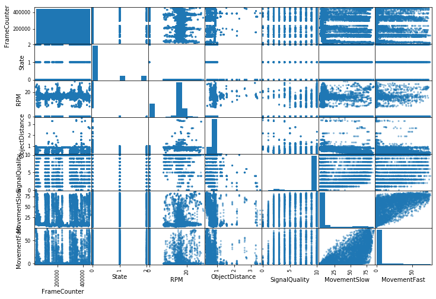


We can clearly, MovmentFast and MovementSlow have somewhat correlation and sate has distributed corelation so using state will not effective for the predictions


```python
data.hist(bins=50, figsize=(20,15))
plt.show()
```


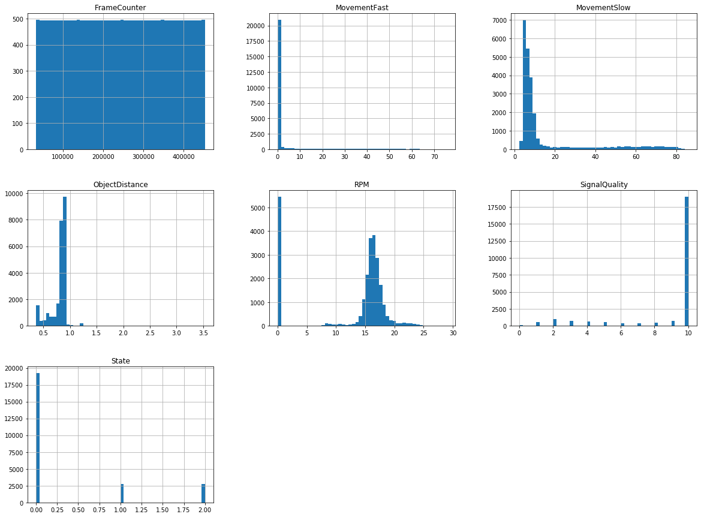


##### According to above histogram FrameCounter does not give valuable information for the prediction it is just a counter, So further training tasks

### Remove miliseconds in timestap


```python
data['TimeStamp'] = data['TimeStamp'].str.slice(stop=-10)
```


```python
data['TimeStamp'] = pd.to_datetime(data['TimeStamp'])
```


```python
# fig, ax1 = plt.subplots(1,1,figsize=(8,4))
# data.plot(x='TimeStamp',y='State', ax=ax1)
fig, axes = plt.subplots(3,2,figsize=(15, 12))
data.plot(x='TimeStamp',y='FrameCounter', ax=axes[0,0])
data.plot(x='TimeStamp',y='SignalQuality', ax=axes[1,0])
data.plot(x='TimeStamp',y='RPM', ax=axes[0,1])
data.plot(x='TimeStamp',y='ObjectDistance', ax=axes[1,1])
data.plot(x='TimeStamp',y='MovementSlow', ax=axes[2,0])
data.plot(x='TimeStamp',y='MovementFast', ax=axes[2,1])
plt.show()
```


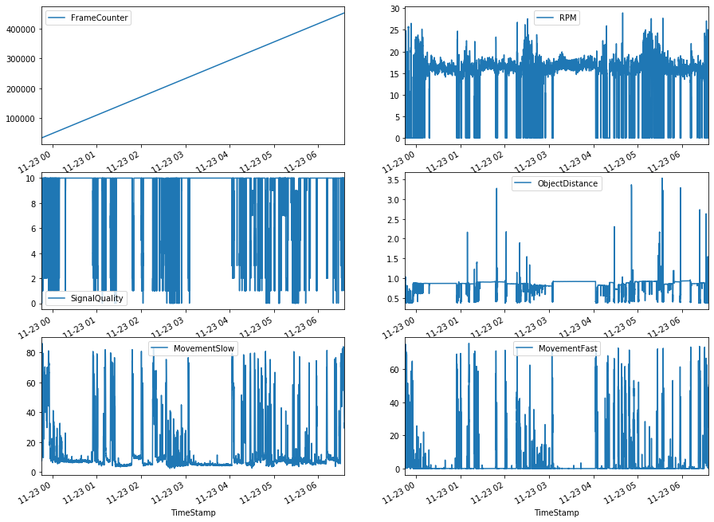


```python
fig, ax1 = plt.subplots(1,1,figsize=(8,4))
data.plot(x='TimeStamp',y='State', ax=ax1)
plt.show()
```


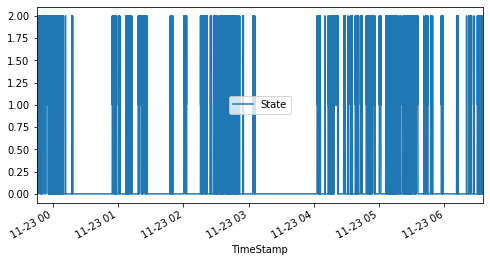


```python
# pd.to_datetime(data['TimeStamp'], format='%d%b%Y:%H:%M:%S.%f')
data['Date'] = [d.date() for d in data['TimeStamp']]
data['Time'] = [d.time() for d in data['TimeStamp']]
```


```python
mid = data['Date']
data.drop("Date", axis=1,inplace = True)
data.insert(0, 'Date', mid)

mid = data['Time']
data.drop("Time", axis=1,inplace = True)
data.insert(1, 'Time', mid)

data.drop("TimeStamp", axis=1, inplace=True)
```


```python
data
```


<div>
<style scoped>
    .dataframe tbody tr th:only-of-type {
        vertical-align: middle;
    }

    .dataframe tbody tr th {
        vertical-align: top;
    }

    .dataframe thead th {
        text-align: right;
    }
</style>
<table border="1" class="dataframe">
  <thead>
    <tr style="text-align: right;">
      <th></th>
      <th>Date</th>
      <th>Time</th>
      <th>FrameCounter</th>
      <th>State</th>
      <th>RPM</th>
      <th>ObjectDistance</th>
      <th>SignalQuality</th>
      <th>MovementSlow</th>
      <th>MovementFast</th>
    </tr>
  </thead>
  <tbody>
    <tr>
      <th>0</th>
      <td>2017-11-22</td>
      <td>23:45:00</td>
      <td>32734</td>
      <td>1</td>
      <td>0.0000</td>
      <td>0.989470</td>
      <td>4</td>
      <td>14.26930</td>
      <td>0.055457</td>
    </tr>
    <tr>
      <th>1</th>
      <td>2017-11-22</td>
      <td>23:45:01</td>
      <td>32751</td>
      <td>1</td>
      <td>0.0000</td>
      <td>0.987036</td>
      <td>4</td>
      <td>12.20640</td>
      <td>0.088731</td>
    </tr>
    <tr>
      <th>2</th>
      <td>2017-11-22</td>
      <td>23:45:02</td>
      <td>32768</td>
      <td>1</td>
      <td>0.0000</td>
      <td>1.008620</td>
      <td>7</td>
      <td>10.84580</td>
      <td>1.696980</td>
    </tr>
    <tr>
      <th>3</th>
      <td>2017-11-22</td>
      <td>23:45:03</td>
      <td>32785</td>
      <td>2</td>
      <td>0.0000</td>
      <td>0.976657</td>
      <td>0</td>
      <td>11.29010</td>
      <td>2.628660</td>
    </tr>
    <tr>
      <th>4</th>
      <td>2017-11-22</td>
      <td>23:45:04</td>
      <td>32802</td>
      <td>1</td>
      <td>0.0000</td>
      <td>0.958549</td>
      <td>0</td>
      <td>13.42030</td>
      <td>3.826530</td>
    </tr>
    <tr>
      <th>5</th>
      <td>2017-11-22</td>
      <td>23:45:05</td>
      <td>32819</td>
      <td>1</td>
      <td>0.0000</td>
      <td>1.021660</td>
      <td>5</td>
      <td>16.41150</td>
      <td>3.981810</td>
    </tr>
    <tr>
      <th>6</th>
      <td>2017-11-22</td>
      <td>23:45:06</td>
      <td>32836</td>
      <td>2</td>
      <td>0.0000</td>
      <td>1.021190</td>
      <td>6</td>
      <td>18.86310</td>
      <td>2.639750</td>
    </tr>
    <tr>
      <th>7</th>
      <td>2017-11-22</td>
      <td>23:45:07</td>
      <td>32853</td>
      <td>1</td>
      <td>0.0000</td>
      <td>1.020810</td>
      <td>6</td>
      <td>20.23170</td>
      <td>2.107360</td>
    </tr>
    <tr>
      <th>8</th>
      <td>2017-11-22</td>
      <td>23:45:08</td>
      <td>32870</td>
      <td>1</td>
      <td>0.0000</td>
      <td>1.022360</td>
      <td>6</td>
      <td>21.00920</td>
      <td>1.563890</td>
    </tr>
    <tr>
      <th>9</th>
      <td>2017-11-22</td>
      <td>23:45:09</td>
      <td>32887</td>
      <td>2</td>
      <td>0.0000</td>
      <td>1.023690</td>
      <td>6</td>
      <td>21.32260</td>
      <td>1.197870</td>
    </tr>
    <tr>
      <th>10</th>
      <td>2017-11-22</td>
      <td>23:45:10</td>
      <td>32904</td>
      <td>1</td>
      <td>0.0000</td>
      <td>1.022360</td>
      <td>6</td>
      <td>21.48130</td>
      <td>0.820763</td>
    </tr>
    <tr>
      <th>11</th>
      <td>2017-11-22</td>
      <td>23:45:11</td>
      <td>32921</td>
      <td>1</td>
      <td>0.0000</td>
      <td>1.002060</td>
      <td>6</td>
      <td>21.77880</td>
      <td>0.776398</td>
    </tr>
    <tr>
      <th>12</th>
      <td>2017-11-22</td>
      <td>23:45:12</td>
      <td>32938</td>
      <td>2</td>
      <td>0.0000</td>
      <td>1.005100</td>
      <td>6</td>
      <td>21.94540</td>
      <td>1.342060</td>
    </tr>
    <tr>
      <th>13</th>
      <td>2017-11-22</td>
      <td>23:45:13</td>
      <td>32955</td>
      <td>2</td>
      <td>0.0000</td>
      <td>1.010820</td>
      <td>6</td>
      <td>22.27070</td>
      <td>1.475160</td>
    </tr>
    <tr>
      <th>14</th>
      <td>2017-11-22</td>
      <td>23:45:14</td>
      <td>32972</td>
      <td>2</td>
      <td>0.0000</td>
      <td>1.023160</td>
      <td>6</td>
      <td>22.68330</td>
      <td>1.652620</td>
    </tr>
    <tr>
      <th>15</th>
      <td>2017-11-22</td>
      <td>23:45:15</td>
      <td>32989</td>
      <td>2</td>
      <td>0.0000</td>
      <td>0.996406</td>
      <td>5</td>
      <td>22.82210</td>
      <td>1.719170</td>
    </tr>
    <tr>
      <th>16</th>
      <td>2017-11-22</td>
      <td>23:45:16</td>
      <td>33006</td>
      <td>1</td>
      <td>0.0000</td>
      <td>0.998060</td>
      <td>5</td>
      <td>22.47300</td>
      <td>1.031500</td>
    </tr>
    <tr>
      <th>17</th>
      <td>2017-11-22</td>
      <td>23:45:17</td>
      <td>33023</td>
      <td>1</td>
      <td>0.0000</td>
      <td>0.998556</td>
      <td>5</td>
      <td>21.64390</td>
      <td>0.876220</td>
    </tr>
    <tr>
      <th>18</th>
      <td>2017-11-22</td>
      <td>23:45:18</td>
      <td>33040</td>
      <td>2</td>
      <td>0.0000</td>
      <td>1.021300</td>
      <td>6</td>
      <td>20.37850</td>
      <td>0.676575</td>
    </tr>
    <tr>
      <th>19</th>
      <td>2017-11-22</td>
      <td>23:45:19</td>
      <td>33057</td>
      <td>1</td>
      <td>0.0000</td>
      <td>1.011650</td>
      <td>6</td>
      <td>18.88690</td>
      <td>0.277285</td>
    </tr>
    <tr>
      <th>20</th>
      <td>2017-11-22</td>
      <td>23:45:20</td>
      <td>33074</td>
      <td>1</td>
      <td>0.0000</td>
      <td>0.996830</td>
      <td>5</td>
      <td>17.70070</td>
      <td>0.177462</td>
    </tr>
    <tr>
      <th>21</th>
      <td>2017-11-22</td>
      <td>23:45:21</td>
      <td>33091</td>
      <td>2</td>
      <td>0.0000</td>
      <td>1.017250</td>
      <td>4</td>
      <td>16.59790</td>
      <td>0.088731</td>
    </tr>
    <tr>
      <th>22</th>
      <td>2017-11-22</td>
      <td>23:45:22</td>
      <td>33108</td>
      <td>2</td>
      <td>0.0000</td>
      <td>1.007130</td>
      <td>3</td>
      <td>15.93940</td>
      <td>0.077640</td>
    </tr>
    <tr>
      <th>23</th>
      <td>2017-11-22</td>
      <td>23:45:23</td>
      <td>33125</td>
      <td>2</td>
      <td>0.0000</td>
      <td>1.000310</td>
      <td>1</td>
      <td>15.32850</td>
      <td>0.033274</td>
    </tr>
    <tr>
      <th>24</th>
      <td>2017-11-22</td>
      <td>23:45:24</td>
      <td>33142</td>
      <td>2</td>
      <td>0.0000</td>
      <td>1.014170</td>
      <td>1</td>
      <td>14.74530</td>
      <td>0.077640</td>
    </tr>
    <tr>
      <th>25</th>
      <td>2017-11-22</td>
      <td>23:45:25</td>
      <td>33159</td>
      <td>1</td>
      <td>0.0000</td>
      <td>1.008120</td>
      <td>2</td>
      <td>14.05510</td>
      <td>0.044366</td>
    </tr>
    <tr>
      <th>26</th>
      <td>2017-11-22</td>
      <td>23:45:26</td>
      <td>33176</td>
      <td>1</td>
      <td>0.0000</td>
      <td>1.004150</td>
      <td>4</td>
      <td>12.91650</td>
      <td>0.000000</td>
    </tr>
    <tr>
      <th>27</th>
      <td>2017-11-22</td>
      <td>23:45:27</td>
      <td>33193</td>
      <td>2</td>
      <td>0.0000</td>
      <td>0.993649</td>
      <td>3</td>
      <td>11.81770</td>
      <td>0.000000</td>
    </tr>
    <tr>
      <th>28</th>
      <td>2017-11-22</td>
      <td>23:45:28</td>
      <td>33210</td>
      <td>1</td>
      <td>0.0000</td>
      <td>0.975221</td>
      <td>0</td>
      <td>10.58390</td>
      <td>0.044366</td>
    </tr>
    <tr>
      <th>29</th>
      <td>2017-11-22</td>
      <td>23:45:29</td>
      <td>33227</td>
      <td>1</td>
      <td>0.0000</td>
      <td>1.014040</td>
      <td>3</td>
      <td>9.57236</td>
      <td>0.011091</td>
    </tr>
    <tr>
      <th>...</th>
      <td>...</td>
      <td>...</td>
      <td>...</td>
      <td>...</td>
      <td>...</td>
      <td>...</td>
      <td>...</td>
      <td>...</td>
      <td>...</td>
    </tr>
    <tr>
      <th>24675</th>
      <td>2017-11-23</td>
      <td>06:35:00</td>
      <td>452209</td>
      <td>2</td>
      <td>0.0000</td>
      <td>0.558913</td>
      <td>10</td>
      <td>41.26860</td>
      <td>0.842946</td>
    </tr>
    <tr>
      <th>24676</th>
      <td>2017-11-23</td>
      <td>06:35:01</td>
      <td>452226</td>
      <td>2</td>
      <td>0.0000</td>
      <td>0.560087</td>
      <td>10</td>
      <td>40.87990</td>
      <td>0.532387</td>
    </tr>
    <tr>
      <th>24677</th>
      <td>2017-11-23</td>
      <td>06:35:02</td>
      <td>452243</td>
      <td>2</td>
      <td>0.0000</td>
      <td>0.559488</td>
      <td>10</td>
      <td>40.46330</td>
      <td>0.576752</td>
    </tr>
    <tr>
      <th>24678</th>
      <td>2017-11-23</td>
      <td>06:35:03</td>
      <td>452260</td>
      <td>2</td>
      <td>0.0000</td>
      <td>0.558793</td>
      <td>10</td>
      <td>40.10630</td>
      <td>0.720941</td>
    </tr>
    <tr>
      <th>24679</th>
      <td>2017-11-23</td>
      <td>06:35:04</td>
      <td>452277</td>
      <td>2</td>
      <td>0.0000</td>
      <td>0.558038</td>
      <td>10</td>
      <td>39.55890</td>
      <td>0.743123</td>
    </tr>
    <tr>
      <th>24680</th>
      <td>2017-11-23</td>
      <td>06:35:05</td>
      <td>452294</td>
      <td>1</td>
      <td>0.0000</td>
      <td>0.557073</td>
      <td>10</td>
      <td>38.93210</td>
      <td>0.876220</td>
    </tr>
    <tr>
      <th>24681</th>
      <td>2017-11-23</td>
      <td>06:35:06</td>
      <td>452311</td>
      <td>1</td>
      <td>0.0000</td>
      <td>0.560343</td>
      <td>10</td>
      <td>38.23790</td>
      <td>0.809672</td>
    </tr>
    <tr>
      <th>24682</th>
      <td>2017-11-23</td>
      <td>06:35:07</td>
      <td>452328</td>
      <td>1</td>
      <td>0.0000</td>
      <td>0.559434</td>
      <td>10</td>
      <td>37.38100</td>
      <td>1.042590</td>
    </tr>
    <tr>
      <th>24683</th>
      <td>2017-11-23</td>
      <td>06:35:08</td>
      <td>452345</td>
      <td>1</td>
      <td>0.0000</td>
      <td>0.561470</td>
      <td>10</td>
      <td>35.69110</td>
      <td>1.098050</td>
    </tr>
    <tr>
      <th>24684</th>
      <td>2017-11-23</td>
      <td>06:35:09</td>
      <td>452362</td>
      <td>2</td>
      <td>0.0000</td>
      <td>0.554580</td>
      <td>6</td>
      <td>33.53300</td>
      <td>0.987134</td>
    </tr>
    <tr>
      <th>24685</th>
      <td>2017-11-23</td>
      <td>06:35:10</td>
      <td>452379</td>
      <td>2</td>
      <td>0.0000</td>
      <td>0.556498</td>
      <td>5</td>
      <td>32.22390</td>
      <td>1.098050</td>
    </tr>
    <tr>
      <th>24686</th>
      <td>2017-11-23</td>
      <td>06:35:11</td>
      <td>452396</td>
      <td>1</td>
      <td>0.0000</td>
      <td>0.525185</td>
      <td>4</td>
      <td>31.88270</td>
      <td>0.942768</td>
    </tr>
    <tr>
      <th>24687</th>
      <td>2017-11-23</td>
      <td>06:35:12</td>
      <td>452413</td>
      <td>1</td>
      <td>0.0000</td>
      <td>0.604039</td>
      <td>3</td>
      <td>32.01760</td>
      <td>0.776398</td>
    </tr>
    <tr>
      <th>24688</th>
      <td>2017-11-23</td>
      <td>06:35:13</td>
      <td>452430</td>
      <td>2</td>
      <td>0.0000</td>
      <td>0.577407</td>
      <td>2</td>
      <td>32.37070</td>
      <td>0.765306</td>
    </tr>
    <tr>
      <th>24689</th>
      <td>2017-11-23</td>
      <td>06:35:14</td>
      <td>452447</td>
      <td>2</td>
      <td>0.0000</td>
      <td>0.538143</td>
      <td>1</td>
      <td>32.47780</td>
      <td>0.343833</td>
    </tr>
    <tr>
      <th>24690</th>
      <td>2017-11-23</td>
      <td>06:35:15</td>
      <td>452464</td>
      <td>2</td>
      <td>0.0000</td>
      <td>0.542100</td>
      <td>2</td>
      <td>32.13270</td>
      <td>0.088731</td>
    </tr>
    <tr>
      <th>24691</th>
      <td>2017-11-23</td>
      <td>06:35:16</td>
      <td>452481</td>
      <td>2</td>
      <td>0.0000</td>
      <td>0.542652</td>
      <td>2</td>
      <td>31.73200</td>
      <td>0.110914</td>
    </tr>
    <tr>
      <th>24692</th>
      <td>2017-11-23</td>
      <td>06:35:17</td>
      <td>452498</td>
      <td>2</td>
      <td>0.0000</td>
      <td>0.538291</td>
      <td>2</td>
      <td>31.29170</td>
      <td>0.110914</td>
    </tr>
    <tr>
      <th>24693</th>
      <td>2017-11-23</td>
      <td>06:35:18</td>
      <td>452515</td>
      <td>0</td>
      <td>17.4612</td>
      <td>0.703331</td>
      <td>10</td>
      <td>30.78390</td>
      <td>0.321650</td>
    </tr>
    <tr>
      <th>24694</th>
      <td>2017-11-23</td>
      <td>06:35:19</td>
      <td>452532</td>
      <td>0</td>
      <td>17.3876</td>
      <td>0.705032</td>
      <td>10</td>
      <td>30.42680</td>
      <td>0.488021</td>
    </tr>
    <tr>
      <th>24695</th>
      <td>2017-11-23</td>
      <td>06:35:20</td>
      <td>452549</td>
      <td>0</td>
      <td>17.2794</td>
      <td>0.706240</td>
      <td>10</td>
      <td>30.45860</td>
      <td>0.532387</td>
    </tr>
    <tr>
      <th>24696</th>
      <td>2017-11-23</td>
      <td>06:35:21</td>
      <td>452566</td>
      <td>0</td>
      <td>17.1584</td>
      <td>0.707170</td>
      <td>10</td>
      <td>30.59740</td>
      <td>0.720941</td>
    </tr>
    <tr>
      <th>24697</th>
      <td>2017-11-23</td>
      <td>06:35:22</td>
      <td>452583</td>
      <td>0</td>
      <td>17.0382</td>
      <td>0.707439</td>
      <td>10</td>
      <td>30.55780</td>
      <td>0.598935</td>
    </tr>
    <tr>
      <th>24698</th>
      <td>2017-11-23</td>
      <td>06:35:23</td>
      <td>452600</td>
      <td>0</td>
      <td>16.9335</td>
      <td>0.706737</td>
      <td>10</td>
      <td>30.43480</td>
      <td>0.865129</td>
    </tr>
    <tr>
      <th>24699</th>
      <td>2017-11-23</td>
      <td>06:35:24</td>
      <td>452617</td>
      <td>0</td>
      <td>16.7811</td>
      <td>0.707123</td>
      <td>10</td>
      <td>29.80010</td>
      <td>0.854037</td>
    </tr>
    <tr>
      <th>24700</th>
      <td>2017-11-23</td>
      <td>06:35:25</td>
      <td>452634</td>
      <td>0</td>
      <td>16.5326</td>
      <td>0.711621</td>
      <td>10</td>
      <td>29.15740</td>
      <td>0.587844</td>
    </tr>
    <tr>
      <th>24701</th>
      <td>2017-11-23</td>
      <td>06:35:26</td>
      <td>452651</td>
      <td>0</td>
      <td>16.1115</td>
      <td>0.713980</td>
      <td>10</td>
      <td>29.34780</td>
      <td>0.754215</td>
    </tr>
    <tr>
      <th>24702</th>
      <td>2017-11-23</td>
      <td>06:35:27</td>
      <td>452668</td>
      <td>0</td>
      <td>15.9265</td>
      <td>0.718161</td>
      <td>10</td>
      <td>29.70090</td>
      <td>1.685890</td>
    </tr>
    <tr>
      <th>24703</th>
      <td>2017-11-23</td>
      <td>06:35:28</td>
      <td>452685</td>
      <td>0</td>
      <td>15.5886</td>
      <td>0.722880</td>
      <td>10</td>
      <td>30.65690</td>
      <td>1.818990</td>
    </tr>
    <tr>
      <th>24704</th>
      <td>2017-11-23</td>
      <td>06:35:29</td>
      <td>452702</td>
      <td>0</td>
      <td>15.5886</td>
      <td>0.722880</td>
      <td>10</td>
      <td>32.60870</td>
      <td>1.885540</td>
    </tr>
  </tbody>
</table>
<p>24705 rows × 9 columns</p>
</div>


```python
data["State"].value_counts()
```


    0    19241
    2     2741
    1     2723
    Name: State, dtype: int64


```python
# data["RPM"].value_counts(ascending=True)
```


```python
# data["ObjectDistance"].value_counts()
```


```python
data["SignalQuality"].value_counts()
```


    10    19018
    2      1037
    3       735
    9       702
    4       640
    1       583
    5       553
    8       514
    7       419
    6       399
    0       105
    Name: SignalQuality, dtype: int64


```python
# data["MovementSlow"].value_counts()
```

# Labels


```python
labels = pd.read_csv("labels.csv",sep=',')
```


```python
labels.describe()
```


<div>
<style scoped>
    .dataframe tbody tr th:only-of-type {
        vertical-align: middle;
    }

    .dataframe tbody tr th {
        vertical-align: top;
    }

    .dataframe thead th {
        text-align: right;
    }
</style>
<table border="1" class="dataframe">
  <thead>
    <tr style="text-align: right;">
      <th></th>
      <th>Start Time: 22.11.2017 23:45:00</th>
    </tr>
  </thead>
  <tbody>
    <tr>
      <th>count</th>
      <td>821</td>
    </tr>
    <tr>
      <th>unique</th>
      <td>5</td>
    </tr>
    <tr>
      <th>top</th>
      <td>000; 3</td>
    </tr>
    <tr>
      <th>freq</th>
      <td>270</td>
    </tr>
  </tbody>
</table>
</div>


```python
labels.head()
```


<div>
<style scoped>
    .dataframe tbody tr th:only-of-type {
        vertical-align: middle;
    }

    .dataframe tbody tr th {
        vertical-align: top;
    }

    .dataframe thead th {
        text-align: right;
    }
</style>
<table border="1" class="dataframe">
  <thead>
    <tr style="text-align: right;">
      <th></th>
      <th>Start Time: 22.11.2017 23:45:00</th>
    </tr>
  </thead>
  <tbody>
    <tr>
      <th>23:45:00</th>
      <td>000; 0</td>
    </tr>
    <tr>
      <th>23:45:30</th>
      <td>000; 0</td>
    </tr>
    <tr>
      <th>23:46:00</th>
      <td>000; 0</td>
    </tr>
    <tr>
      <th>23:46:30</th>
      <td>000; 0</td>
    </tr>
    <tr>
      <th>23:47:00</th>
      <td>000; 0</td>
    </tr>
  </tbody>
</table>
</div>


```python
labels.tail()
```


<div>
<style scoped>
    .dataframe tbody tr th:only-of-type {
        vertical-align: middle;
    }

    .dataframe tbody tr th {
        vertical-align: top;
    }

    .dataframe thead th {
        text-align: right;
    }
</style>
<table border="1" class="dataframe">
  <thead>
    <tr style="text-align: right;">
      <th></th>
      <th>Start Time: 22.11.2017 23:45:00</th>
    </tr>
  </thead>
  <tbody>
    <tr>
      <th>06:33:00</th>
      <td>000; 0</td>
    </tr>
    <tr>
      <th>06:33:30</th>
      <td>000; 0</td>
    </tr>
    <tr>
      <th>06:34:00</th>
      <td>000; 0</td>
    </tr>
    <tr>
      <th>06:34:30</th>
      <td>000; 0</td>
    </tr>
    <tr>
      <th>06:35:00</th>
      <td>000; 2</td>
    </tr>
  </tbody>
</table>
</div>


Labels has only one colum


```python
print(len(labels.columns))
labels.columns
```

    1
    


    Index(['Start Time: 22.11.2017 23:45:00'], dtype='object')


```python
# labels['Start Time: 22.11.2017 23:45:00'].hist(bins=50)
# plt.show()
```


```python
# labels['TimeStamp'] = labels['Start Time: 22.11.2017 23:45:00'].str.slice(stop=-4)
labels.iloc[-1:]
```


<div>
<style scoped>
    .dataframe tbody tr th:only-of-type {
        vertical-align: middle;
    }

    .dataframe tbody tr th {
        vertical-align: top;
    }

    .dataframe thead th {
        text-align: right;
    }
</style>
<table border="1" class="dataframe">
  <thead>
    <tr style="text-align: right;">
      <th></th>
      <th>Start Time: 22.11.2017 23:45:00</th>
    </tr>
  </thead>
  <tbody>
    <tr>
      <th>06:35:00</th>
      <td>000; 2</td>
    </tr>
  </tbody>
</table>
</div>


```python
labels.dtypes
```


    Start Time: 22.11.2017 23:45:00    object
    dtype: object


```python
labels = labels.reset_index()
labels["TimeStamp"] = labels["index"]
labels = labels.drop("index", axis=1)
mid = labels['TimeStamp']
labels.drop(labels=['TimeStamp'], axis=1,inplace = True)
labels.insert(0, 'TimeStamp', mid)
```


```python
labels["Label"] = labels["Start Time: 22.11.2017 23:45:00"].str.slice(start=-1)
```


```python
labels = labels.drop("Start Time: 22.11.2017 23:45:00", axis=1)
```


```python
# labels['TimeStamp'] = [d.time() for d in labels['TimeStamp']]
ad = pd.to_datetime(labels['TimeStamp'])
labels['TimeStamp'] = ad.dt.strftime('%H:%M:%S')

```


```python
labels.describe()
```


<div>
<style scoped>
    .dataframe tbody tr th:only-of-type {
        vertical-align: middle;
    }

    .dataframe tbody tr th {
        vertical-align: top;
    }

    .dataframe thead th {
        text-align: right;
    }
</style>
<table border="1" class="dataframe">
  <thead>
    <tr style="text-align: right;">
      <th></th>
      <th>TimeStamp</th>
      <th>Label</th>
    </tr>
  </thead>
  <tbody>
    <tr>
      <th>count</th>
      <td>821</td>
      <td>821</td>
    </tr>
    <tr>
      <th>unique</th>
      <td>821</td>
      <td>5</td>
    </tr>
    <tr>
      <th>top</th>
      <td>03:58:00</td>
      <td>3</td>
    </tr>
    <tr>
      <th>freq</th>
      <td>1</td>
      <td>270</td>
    </tr>
  </tbody>
</table>
</div>


```python
# labels["TimeStamp"].iloc[0]
```


```python
data.head()
```


<div>
<style scoped>
    .dataframe tbody tr th:only-of-type {
        vertical-align: middle;
    }

    .dataframe tbody tr th {
        vertical-align: top;
    }

    .dataframe thead th {
        text-align: right;
    }
</style>
<table border="1" class="dataframe">
  <thead>
    <tr style="text-align: right;">
      <th></th>
      <th>Date</th>
      <th>Time</th>
      <th>FrameCounter</th>
      <th>State</th>
      <th>RPM</th>
      <th>ObjectDistance</th>
      <th>SignalQuality</th>
      <th>MovementSlow</th>
      <th>MovementFast</th>
    </tr>
  </thead>
  <tbody>
    <tr>
      <th>0</th>
      <td>2017-11-22</td>
      <td>23:45:00</td>
      <td>32734</td>
      <td>1</td>
      <td>0.0</td>
      <td>0.989470</td>
      <td>4</td>
      <td>14.2693</td>
      <td>0.055457</td>
    </tr>
    <tr>
      <th>1</th>
      <td>2017-11-22</td>
      <td>23:45:01</td>
      <td>32751</td>
      <td>1</td>
      <td>0.0</td>
      <td>0.987036</td>
      <td>4</td>
      <td>12.2064</td>
      <td>0.088731</td>
    </tr>
    <tr>
      <th>2</th>
      <td>2017-11-22</td>
      <td>23:45:02</td>
      <td>32768</td>
      <td>1</td>
      <td>0.0</td>
      <td>1.008620</td>
      <td>7</td>
      <td>10.8458</td>
      <td>1.696980</td>
    </tr>
    <tr>
      <th>3</th>
      <td>2017-11-22</td>
      <td>23:45:03</td>
      <td>32785</td>
      <td>2</td>
      <td>0.0</td>
      <td>0.976657</td>
      <td>0</td>
      <td>11.2901</td>
      <td>2.628660</td>
    </tr>
    <tr>
      <th>4</th>
      <td>2017-11-22</td>
      <td>23:45:04</td>
      <td>32802</td>
      <td>1</td>
      <td>0.0</td>
      <td>0.958549</td>
      <td>0</td>
      <td>13.4203</td>
      <td>3.826530</td>
    </tr>
  </tbody>
</table>
</div>


```python
data.tail()
```


<div>
<style scoped>
    .dataframe tbody tr th:only-of-type {
        vertical-align: middle;
    }

    .dataframe tbody tr th {
        vertical-align: top;
    }

    .dataframe thead th {
        text-align: right;
    }
</style>
<table border="1" class="dataframe">
  <thead>
    <tr style="text-align: right;">
      <th></th>
      <th>Date</th>
      <th>Time</th>
      <th>FrameCounter</th>
      <th>State</th>
      <th>RPM</th>
      <th>ObjectDistance</th>
      <th>SignalQuality</th>
      <th>MovementSlow</th>
      <th>MovementFast</th>
    </tr>
  </thead>
  <tbody>
    <tr>
      <th>24700</th>
      <td>2017-11-23</td>
      <td>06:35:25</td>
      <td>452634</td>
      <td>0</td>
      <td>16.5326</td>
      <td>0.711621</td>
      <td>10</td>
      <td>29.1574</td>
      <td>0.587844</td>
    </tr>
    <tr>
      <th>24701</th>
      <td>2017-11-23</td>
      <td>06:35:26</td>
      <td>452651</td>
      <td>0</td>
      <td>16.1115</td>
      <td>0.713980</td>
      <td>10</td>
      <td>29.3478</td>
      <td>0.754215</td>
    </tr>
    <tr>
      <th>24702</th>
      <td>2017-11-23</td>
      <td>06:35:27</td>
      <td>452668</td>
      <td>0</td>
      <td>15.9265</td>
      <td>0.718161</td>
      <td>10</td>
      <td>29.7009</td>
      <td>1.685890</td>
    </tr>
    <tr>
      <th>24703</th>
      <td>2017-11-23</td>
      <td>06:35:28</td>
      <td>452685</td>
      <td>0</td>
      <td>15.5886</td>
      <td>0.722880</td>
      <td>10</td>
      <td>30.6569</td>
      <td>1.818990</td>
    </tr>
    <tr>
      <th>24704</th>
      <td>2017-11-23</td>
      <td>06:35:29</td>
      <td>452702</td>
      <td>0</td>
      <td>15.5886</td>
      <td>0.722880</td>
      <td>10</td>
      <td>32.6087</td>
      <td>1.885540</td>
    </tr>
  </tbody>
</table>
</div>


### There is a missing in 30 pattern in data file


```python
data["Time"].iloc[::30]
```


    0        23:45:00
    30       23:45:30
    60       23:46:00
    90       23:46:30
    120      23:47:00
    150      23:47:30
    180      23:48:00
    210      23:48:30
    240      23:49:00
    270      23:49:30
    300      23:49:59
    330      23:50:29
    360      23:50:59
    390      23:51:29
    420      23:51:59
    450      23:52:29
    480      23:52:59
    510      23:53:29
    540      23:53:59
    570      23:54:29
    600      23:54:59
    630      23:55:28
    660      23:55:58
    690      23:56:28
    720      23:56:58
    750      23:57:28
    780      23:57:58
    810      23:58:28
    840      23:58:58
    870      23:59:28
               ...   
    23820    06:20:48
    23850    06:21:18
    23880    06:21:48
    23910    06:22:17
    23940    06:22:47
    23970    06:23:17
    24000    06:23:47
    24030    06:24:17
    24060    06:24:47
    24090    06:25:17
    24120    06:25:47
    24150    06:26:17
    24180    06:26:47
    24210    06:27:17
    24240    06:27:46
    24270    06:28:16
    24300    06:28:46
    24330    06:29:16
    24360    06:29:46
    24390    06:30:16
    24420    06:30:46
    24450    06:31:16
    24480    06:31:46
    24510    06:32:16
    24540    06:32:46
    24570    06:33:15
    24600    06:33:45
    24630    06:34:15
    24660    06:34:45
    24690    06:35:15
    Name: Time, Length: 824, dtype: object


# Data Preparation

Below function returns the all 00 and 30 second times in the data file


```python
data
```


<div>
<style scoped>
    .dataframe tbody tr th:only-of-type {
        vertical-align: middle;
    }

    .dataframe tbody tr th {
        vertical-align: top;
    }

    .dataframe thead th {
        text-align: right;
    }
</style>
<table border="1" class="dataframe">
  <thead>
    <tr style="text-align: right;">
      <th></th>
      <th>Date</th>
      <th>Time</th>
      <th>FrameCounter</th>
      <th>State</th>
      <th>RPM</th>
      <th>ObjectDistance</th>
      <th>SignalQuality</th>
      <th>MovementSlow</th>
      <th>MovementFast</th>
    </tr>
  </thead>
  <tbody>
    <tr>
      <th>0</th>
      <td>2017-11-22</td>
      <td>23:45:00</td>
      <td>32734</td>
      <td>1</td>
      <td>0.0000</td>
      <td>0.989470</td>
      <td>4</td>
      <td>14.26930</td>
      <td>0.055457</td>
    </tr>
    <tr>
      <th>1</th>
      <td>2017-11-22</td>
      <td>23:45:01</td>
      <td>32751</td>
      <td>1</td>
      <td>0.0000</td>
      <td>0.987036</td>
      <td>4</td>
      <td>12.20640</td>
      <td>0.088731</td>
    </tr>
    <tr>
      <th>2</th>
      <td>2017-11-22</td>
      <td>23:45:02</td>
      <td>32768</td>
      <td>1</td>
      <td>0.0000</td>
      <td>1.008620</td>
      <td>7</td>
      <td>10.84580</td>
      <td>1.696980</td>
    </tr>
    <tr>
      <th>3</th>
      <td>2017-11-22</td>
      <td>23:45:03</td>
      <td>32785</td>
      <td>2</td>
      <td>0.0000</td>
      <td>0.976657</td>
      <td>0</td>
      <td>11.29010</td>
      <td>2.628660</td>
    </tr>
    <tr>
      <th>4</th>
      <td>2017-11-22</td>
      <td>23:45:04</td>
      <td>32802</td>
      <td>1</td>
      <td>0.0000</td>
      <td>0.958549</td>
      <td>0</td>
      <td>13.42030</td>
      <td>3.826530</td>
    </tr>
    <tr>
      <th>5</th>
      <td>2017-11-22</td>
      <td>23:45:05</td>
      <td>32819</td>
      <td>1</td>
      <td>0.0000</td>
      <td>1.021660</td>
      <td>5</td>
      <td>16.41150</td>
      <td>3.981810</td>
    </tr>
    <tr>
      <th>6</th>
      <td>2017-11-22</td>
      <td>23:45:06</td>
      <td>32836</td>
      <td>2</td>
      <td>0.0000</td>
      <td>1.021190</td>
      <td>6</td>
      <td>18.86310</td>
      <td>2.639750</td>
    </tr>
    <tr>
      <th>7</th>
      <td>2017-11-22</td>
      <td>23:45:07</td>
      <td>32853</td>
      <td>1</td>
      <td>0.0000</td>
      <td>1.020810</td>
      <td>6</td>
      <td>20.23170</td>
      <td>2.107360</td>
    </tr>
    <tr>
      <th>8</th>
      <td>2017-11-22</td>
      <td>23:45:08</td>
      <td>32870</td>
      <td>1</td>
      <td>0.0000</td>
      <td>1.022360</td>
      <td>6</td>
      <td>21.00920</td>
      <td>1.563890</td>
    </tr>
    <tr>
      <th>9</th>
      <td>2017-11-22</td>
      <td>23:45:09</td>
      <td>32887</td>
      <td>2</td>
      <td>0.0000</td>
      <td>1.023690</td>
      <td>6</td>
      <td>21.32260</td>
      <td>1.197870</td>
    </tr>
    <tr>
      <th>10</th>
      <td>2017-11-22</td>
      <td>23:45:10</td>
      <td>32904</td>
      <td>1</td>
      <td>0.0000</td>
      <td>1.022360</td>
      <td>6</td>
      <td>21.48130</td>
      <td>0.820763</td>
    </tr>
    <tr>
      <th>11</th>
      <td>2017-11-22</td>
      <td>23:45:11</td>
      <td>32921</td>
      <td>1</td>
      <td>0.0000</td>
      <td>1.002060</td>
      <td>6</td>
      <td>21.77880</td>
      <td>0.776398</td>
    </tr>
    <tr>
      <th>12</th>
      <td>2017-11-22</td>
      <td>23:45:12</td>
      <td>32938</td>
      <td>2</td>
      <td>0.0000</td>
      <td>1.005100</td>
      <td>6</td>
      <td>21.94540</td>
      <td>1.342060</td>
    </tr>
    <tr>
      <th>13</th>
      <td>2017-11-22</td>
      <td>23:45:13</td>
      <td>32955</td>
      <td>2</td>
      <td>0.0000</td>
      <td>1.010820</td>
      <td>6</td>
      <td>22.27070</td>
      <td>1.475160</td>
    </tr>
    <tr>
      <th>14</th>
      <td>2017-11-22</td>
      <td>23:45:14</td>
      <td>32972</td>
      <td>2</td>
      <td>0.0000</td>
      <td>1.023160</td>
      <td>6</td>
      <td>22.68330</td>
      <td>1.652620</td>
    </tr>
    <tr>
      <th>15</th>
      <td>2017-11-22</td>
      <td>23:45:15</td>
      <td>32989</td>
      <td>2</td>
      <td>0.0000</td>
      <td>0.996406</td>
      <td>5</td>
      <td>22.82210</td>
      <td>1.719170</td>
    </tr>
    <tr>
      <th>16</th>
      <td>2017-11-22</td>
      <td>23:45:16</td>
      <td>33006</td>
      <td>1</td>
      <td>0.0000</td>
      <td>0.998060</td>
      <td>5</td>
      <td>22.47300</td>
      <td>1.031500</td>
    </tr>
    <tr>
      <th>17</th>
      <td>2017-11-22</td>
      <td>23:45:17</td>
      <td>33023</td>
      <td>1</td>
      <td>0.0000</td>
      <td>0.998556</td>
      <td>5</td>
      <td>21.64390</td>
      <td>0.876220</td>
    </tr>
    <tr>
      <th>18</th>
      <td>2017-11-22</td>
      <td>23:45:18</td>
      <td>33040</td>
      <td>2</td>
      <td>0.0000</td>
      <td>1.021300</td>
      <td>6</td>
      <td>20.37850</td>
      <td>0.676575</td>
    </tr>
    <tr>
      <th>19</th>
      <td>2017-11-22</td>
      <td>23:45:19</td>
      <td>33057</td>
      <td>1</td>
      <td>0.0000</td>
      <td>1.011650</td>
      <td>6</td>
      <td>18.88690</td>
      <td>0.277285</td>
    </tr>
    <tr>
      <th>20</th>
      <td>2017-11-22</td>
      <td>23:45:20</td>
      <td>33074</td>
      <td>1</td>
      <td>0.0000</td>
      <td>0.996830</td>
      <td>5</td>
      <td>17.70070</td>
      <td>0.177462</td>
    </tr>
    <tr>
      <th>21</th>
      <td>2017-11-22</td>
      <td>23:45:21</td>
      <td>33091</td>
      <td>2</td>
      <td>0.0000</td>
      <td>1.017250</td>
      <td>4</td>
      <td>16.59790</td>
      <td>0.088731</td>
    </tr>
    <tr>
      <th>22</th>
      <td>2017-11-22</td>
      <td>23:45:22</td>
      <td>33108</td>
      <td>2</td>
      <td>0.0000</td>
      <td>1.007130</td>
      <td>3</td>
      <td>15.93940</td>
      <td>0.077640</td>
    </tr>
    <tr>
      <th>23</th>
      <td>2017-11-22</td>
      <td>23:45:23</td>
      <td>33125</td>
      <td>2</td>
      <td>0.0000</td>
      <td>1.000310</td>
      <td>1</td>
      <td>15.32850</td>
      <td>0.033274</td>
    </tr>
    <tr>
      <th>24</th>
      <td>2017-11-22</td>
      <td>23:45:24</td>
      <td>33142</td>
      <td>2</td>
      <td>0.0000</td>
      <td>1.014170</td>
      <td>1</td>
      <td>14.74530</td>
      <td>0.077640</td>
    </tr>
    <tr>
      <th>25</th>
      <td>2017-11-22</td>
      <td>23:45:25</td>
      <td>33159</td>
      <td>1</td>
      <td>0.0000</td>
      <td>1.008120</td>
      <td>2</td>
      <td>14.05510</td>
      <td>0.044366</td>
    </tr>
    <tr>
      <th>26</th>
      <td>2017-11-22</td>
      <td>23:45:26</td>
      <td>33176</td>
      <td>1</td>
      <td>0.0000</td>
      <td>1.004150</td>
      <td>4</td>
      <td>12.91650</td>
      <td>0.000000</td>
    </tr>
    <tr>
      <th>27</th>
      <td>2017-11-22</td>
      <td>23:45:27</td>
      <td>33193</td>
      <td>2</td>
      <td>0.0000</td>
      <td>0.993649</td>
      <td>3</td>
      <td>11.81770</td>
      <td>0.000000</td>
    </tr>
    <tr>
      <th>28</th>
      <td>2017-11-22</td>
      <td>23:45:28</td>
      <td>33210</td>
      <td>1</td>
      <td>0.0000</td>
      <td>0.975221</td>
      <td>0</td>
      <td>10.58390</td>
      <td>0.044366</td>
    </tr>
    <tr>
      <th>29</th>
      <td>2017-11-22</td>
      <td>23:45:29</td>
      <td>33227</td>
      <td>1</td>
      <td>0.0000</td>
      <td>1.014040</td>
      <td>3</td>
      <td>9.57236</td>
      <td>0.011091</td>
    </tr>
    <tr>
      <th>...</th>
      <td>...</td>
      <td>...</td>
      <td>...</td>
      <td>...</td>
      <td>...</td>
      <td>...</td>
      <td>...</td>
      <td>...</td>
      <td>...</td>
    </tr>
    <tr>
      <th>24675</th>
      <td>2017-11-23</td>
      <td>06:35:00</td>
      <td>452209</td>
      <td>2</td>
      <td>0.0000</td>
      <td>0.558913</td>
      <td>10</td>
      <td>41.26860</td>
      <td>0.842946</td>
    </tr>
    <tr>
      <th>24676</th>
      <td>2017-11-23</td>
      <td>06:35:01</td>
      <td>452226</td>
      <td>2</td>
      <td>0.0000</td>
      <td>0.560087</td>
      <td>10</td>
      <td>40.87990</td>
      <td>0.532387</td>
    </tr>
    <tr>
      <th>24677</th>
      <td>2017-11-23</td>
      <td>06:35:02</td>
      <td>452243</td>
      <td>2</td>
      <td>0.0000</td>
      <td>0.559488</td>
      <td>10</td>
      <td>40.46330</td>
      <td>0.576752</td>
    </tr>
    <tr>
      <th>24678</th>
      <td>2017-11-23</td>
      <td>06:35:03</td>
      <td>452260</td>
      <td>2</td>
      <td>0.0000</td>
      <td>0.558793</td>
      <td>10</td>
      <td>40.10630</td>
      <td>0.720941</td>
    </tr>
    <tr>
      <th>24679</th>
      <td>2017-11-23</td>
      <td>06:35:04</td>
      <td>452277</td>
      <td>2</td>
      <td>0.0000</td>
      <td>0.558038</td>
      <td>10</td>
      <td>39.55890</td>
      <td>0.743123</td>
    </tr>
    <tr>
      <th>24680</th>
      <td>2017-11-23</td>
      <td>06:35:05</td>
      <td>452294</td>
      <td>1</td>
      <td>0.0000</td>
      <td>0.557073</td>
      <td>10</td>
      <td>38.93210</td>
      <td>0.876220</td>
    </tr>
    <tr>
      <th>24681</th>
      <td>2017-11-23</td>
      <td>06:35:06</td>
      <td>452311</td>
      <td>1</td>
      <td>0.0000</td>
      <td>0.560343</td>
      <td>10</td>
      <td>38.23790</td>
      <td>0.809672</td>
    </tr>
    <tr>
      <th>24682</th>
      <td>2017-11-23</td>
      <td>06:35:07</td>
      <td>452328</td>
      <td>1</td>
      <td>0.0000</td>
      <td>0.559434</td>
      <td>10</td>
      <td>37.38100</td>
      <td>1.042590</td>
    </tr>
    <tr>
      <th>24683</th>
      <td>2017-11-23</td>
      <td>06:35:08</td>
      <td>452345</td>
      <td>1</td>
      <td>0.0000</td>
      <td>0.561470</td>
      <td>10</td>
      <td>35.69110</td>
      <td>1.098050</td>
    </tr>
    <tr>
      <th>24684</th>
      <td>2017-11-23</td>
      <td>06:35:09</td>
      <td>452362</td>
      <td>2</td>
      <td>0.0000</td>
      <td>0.554580</td>
      <td>6</td>
      <td>33.53300</td>
      <td>0.987134</td>
    </tr>
    <tr>
      <th>24685</th>
      <td>2017-11-23</td>
      <td>06:35:10</td>
      <td>452379</td>
      <td>2</td>
      <td>0.0000</td>
      <td>0.556498</td>
      <td>5</td>
      <td>32.22390</td>
      <td>1.098050</td>
    </tr>
    <tr>
      <th>24686</th>
      <td>2017-11-23</td>
      <td>06:35:11</td>
      <td>452396</td>
      <td>1</td>
      <td>0.0000</td>
      <td>0.525185</td>
      <td>4</td>
      <td>31.88270</td>
      <td>0.942768</td>
    </tr>
    <tr>
      <th>24687</th>
      <td>2017-11-23</td>
      <td>06:35:12</td>
      <td>452413</td>
      <td>1</td>
      <td>0.0000</td>
      <td>0.604039</td>
      <td>3</td>
      <td>32.01760</td>
      <td>0.776398</td>
    </tr>
    <tr>
      <th>24688</th>
      <td>2017-11-23</td>
      <td>06:35:13</td>
      <td>452430</td>
      <td>2</td>
      <td>0.0000</td>
      <td>0.577407</td>
      <td>2</td>
      <td>32.37070</td>
      <td>0.765306</td>
    </tr>
    <tr>
      <th>24689</th>
      <td>2017-11-23</td>
      <td>06:35:14</td>
      <td>452447</td>
      <td>2</td>
      <td>0.0000</td>
      <td>0.538143</td>
      <td>1</td>
      <td>32.47780</td>
      <td>0.343833</td>
    </tr>
    <tr>
      <th>24690</th>
      <td>2017-11-23</td>
      <td>06:35:15</td>
      <td>452464</td>
      <td>2</td>
      <td>0.0000</td>
      <td>0.542100</td>
      <td>2</td>
      <td>32.13270</td>
      <td>0.088731</td>
    </tr>
    <tr>
      <th>24691</th>
      <td>2017-11-23</td>
      <td>06:35:16</td>
      <td>452481</td>
      <td>2</td>
      <td>0.0000</td>
      <td>0.542652</td>
      <td>2</td>
      <td>31.73200</td>
      <td>0.110914</td>
    </tr>
    <tr>
      <th>24692</th>
      <td>2017-11-23</td>
      <td>06:35:17</td>
      <td>452498</td>
      <td>2</td>
      <td>0.0000</td>
      <td>0.538291</td>
      <td>2</td>
      <td>31.29170</td>
      <td>0.110914</td>
    </tr>
    <tr>
      <th>24693</th>
      <td>2017-11-23</td>
      <td>06:35:18</td>
      <td>452515</td>
      <td>0</td>
      <td>17.4612</td>
      <td>0.703331</td>
      <td>10</td>
      <td>30.78390</td>
      <td>0.321650</td>
    </tr>
    <tr>
      <th>24694</th>
      <td>2017-11-23</td>
      <td>06:35:19</td>
      <td>452532</td>
      <td>0</td>
      <td>17.3876</td>
      <td>0.705032</td>
      <td>10</td>
      <td>30.42680</td>
      <td>0.488021</td>
    </tr>
    <tr>
      <th>24695</th>
      <td>2017-11-23</td>
      <td>06:35:20</td>
      <td>452549</td>
      <td>0</td>
      <td>17.2794</td>
      <td>0.706240</td>
      <td>10</td>
      <td>30.45860</td>
      <td>0.532387</td>
    </tr>
    <tr>
      <th>24696</th>
      <td>2017-11-23</td>
      <td>06:35:21</td>
      <td>452566</td>
      <td>0</td>
      <td>17.1584</td>
      <td>0.707170</td>
      <td>10</td>
      <td>30.59740</td>
      <td>0.720941</td>
    </tr>
    <tr>
      <th>24697</th>
      <td>2017-11-23</td>
      <td>06:35:22</td>
      <td>452583</td>
      <td>0</td>
      <td>17.0382</td>
      <td>0.707439</td>
      <td>10</td>
      <td>30.55780</td>
      <td>0.598935</td>
    </tr>
    <tr>
      <th>24698</th>
      <td>2017-11-23</td>
      <td>06:35:23</td>
      <td>452600</td>
      <td>0</td>
      <td>16.9335</td>
      <td>0.706737</td>
      <td>10</td>
      <td>30.43480</td>
      <td>0.865129</td>
    </tr>
    <tr>
      <th>24699</th>
      <td>2017-11-23</td>
      <td>06:35:24</td>
      <td>452617</td>
      <td>0</td>
      <td>16.7811</td>
      <td>0.707123</td>
      <td>10</td>
      <td>29.80010</td>
      <td>0.854037</td>
    </tr>
    <tr>
      <th>24700</th>
      <td>2017-11-23</td>
      <td>06:35:25</td>
      <td>452634</td>
      <td>0</td>
      <td>16.5326</td>
      <td>0.711621</td>
      <td>10</td>
      <td>29.15740</td>
      <td>0.587844</td>
    </tr>
    <tr>
      <th>24701</th>
      <td>2017-11-23</td>
      <td>06:35:26</td>
      <td>452651</td>
      <td>0</td>
      <td>16.1115</td>
      <td>0.713980</td>
      <td>10</td>
      <td>29.34780</td>
      <td>0.754215</td>
    </tr>
    <tr>
      <th>24702</th>
      <td>2017-11-23</td>
      <td>06:35:27</td>
      <td>452668</td>
      <td>0</td>
      <td>15.9265</td>
      <td>0.718161</td>
      <td>10</td>
      <td>29.70090</td>
      <td>1.685890</td>
    </tr>
    <tr>
      <th>24703</th>
      <td>2017-11-23</td>
      <td>06:35:28</td>
      <td>452685</td>
      <td>0</td>
      <td>15.5886</td>
      <td>0.722880</td>
      <td>10</td>
      <td>30.65690</td>
      <td>1.818990</td>
    </tr>
    <tr>
      <th>24704</th>
      <td>2017-11-23</td>
      <td>06:35:29</td>
      <td>452702</td>
      <td>0</td>
      <td>15.5886</td>
      <td>0.722880</td>
      <td>10</td>
      <td>32.60870</td>
      <td>1.885540</td>
    </tr>
  </tbody>
</table>
<p>24705 rows × 9 columns</p>
</div>


```python
labels
```


<div>
<style scoped>
    .dataframe tbody tr th:only-of-type {
        vertical-align: middle;
    }

    .dataframe tbody tr th {
        vertical-align: top;
    }

    .dataframe thead th {
        text-align: right;
    }
</style>
<table border="1" class="dataframe">
  <thead>
    <tr style="text-align: right;">
      <th></th>
      <th>TimeStamp</th>
      <th>Label</th>
    </tr>
  </thead>
  <tbody>
    <tr>
      <th>0</th>
      <td>23:45:00</td>
      <td>0</td>
    </tr>
    <tr>
      <th>1</th>
      <td>23:45:30</td>
      <td>0</td>
    </tr>
    <tr>
      <th>2</th>
      <td>23:46:00</td>
      <td>0</td>
    </tr>
    <tr>
      <th>3</th>
      <td>23:46:30</td>
      <td>0</td>
    </tr>
    <tr>
      <th>4</th>
      <td>23:47:00</td>
      <td>0</td>
    </tr>
    <tr>
      <th>5</th>
      <td>23:47:30</td>
      <td>0</td>
    </tr>
    <tr>
      <th>6</th>
      <td>23:48:00</td>
      <td>0</td>
    </tr>
    <tr>
      <th>7</th>
      <td>23:48:30</td>
      <td>0</td>
    </tr>
    <tr>
      <th>8</th>
      <td>23:49:00</td>
      <td>0</td>
    </tr>
    <tr>
      <th>9</th>
      <td>23:49:30</td>
      <td>1</td>
    </tr>
    <tr>
      <th>10</th>
      <td>23:50:00</td>
      <td>1</td>
    </tr>
    <tr>
      <th>11</th>
      <td>23:50:30</td>
      <td>0</td>
    </tr>
    <tr>
      <th>12</th>
      <td>23:51:00</td>
      <td>0</td>
    </tr>
    <tr>
      <th>13</th>
      <td>23:51:30</td>
      <td>0</td>
    </tr>
    <tr>
      <th>14</th>
      <td>23:52:00</td>
      <td>0</td>
    </tr>
    <tr>
      <th>15</th>
      <td>23:52:30</td>
      <td>0</td>
    </tr>
    <tr>
      <th>16</th>
      <td>23:53:00</td>
      <td>0</td>
    </tr>
    <tr>
      <th>17</th>
      <td>23:53:30</td>
      <td>0</td>
    </tr>
    <tr>
      <th>18</th>
      <td>23:54:00</td>
      <td>0</td>
    </tr>
    <tr>
      <th>19</th>
      <td>23:54:30</td>
      <td>1</td>
    </tr>
    <tr>
      <th>20</th>
      <td>23:55:00</td>
      <td>1</td>
    </tr>
    <tr>
      <th>21</th>
      <td>23:55:30</td>
      <td>0</td>
    </tr>
    <tr>
      <th>22</th>
      <td>23:56:00</td>
      <td>0</td>
    </tr>
    <tr>
      <th>23</th>
      <td>23:56:30</td>
      <td>0</td>
    </tr>
    <tr>
      <th>24</th>
      <td>23:57:00</td>
      <td>0</td>
    </tr>
    <tr>
      <th>25</th>
      <td>23:57:30</td>
      <td>0</td>
    </tr>
    <tr>
      <th>26</th>
      <td>23:58:00</td>
      <td>0</td>
    </tr>
    <tr>
      <th>27</th>
      <td>23:58:30</td>
      <td>0</td>
    </tr>
    <tr>
      <th>28</th>
      <td>23:59:00</td>
      <td>0</td>
    </tr>
    <tr>
      <th>29</th>
      <td>23:59:30</td>
      <td>1</td>
    </tr>
    <tr>
      <th>...</th>
      <td>...</td>
      <td>...</td>
    </tr>
    <tr>
      <th>791</th>
      <td>06:20:30</td>
      <td>2</td>
    </tr>
    <tr>
      <th>792</th>
      <td>06:21:00</td>
      <td>2</td>
    </tr>
    <tr>
      <th>793</th>
      <td>06:21:30</td>
      <td>2</td>
    </tr>
    <tr>
      <th>794</th>
      <td>06:22:00</td>
      <td>2</td>
    </tr>
    <tr>
      <th>795</th>
      <td>06:22:30</td>
      <td>3</td>
    </tr>
    <tr>
      <th>796</th>
      <td>06:23:00</td>
      <td>2</td>
    </tr>
    <tr>
      <th>797</th>
      <td>06:23:30</td>
      <td>2</td>
    </tr>
    <tr>
      <th>798</th>
      <td>06:24:00</td>
      <td>2</td>
    </tr>
    <tr>
      <th>799</th>
      <td>06:24:30</td>
      <td>2</td>
    </tr>
    <tr>
      <th>800</th>
      <td>06:25:00</td>
      <td>2</td>
    </tr>
    <tr>
      <th>801</th>
      <td>06:25:30</td>
      <td>2</td>
    </tr>
    <tr>
      <th>802</th>
      <td>06:26:00</td>
      <td>0</td>
    </tr>
    <tr>
      <th>803</th>
      <td>06:26:30</td>
      <td>0</td>
    </tr>
    <tr>
      <th>804</th>
      <td>06:27:00</td>
      <td>1</td>
    </tr>
    <tr>
      <th>805</th>
      <td>06:27:30</td>
      <td>1</td>
    </tr>
    <tr>
      <th>806</th>
      <td>06:28:00</td>
      <td>2</td>
    </tr>
    <tr>
      <th>807</th>
      <td>06:28:30</td>
      <td>2</td>
    </tr>
    <tr>
      <th>808</th>
      <td>06:29:00</td>
      <td>2</td>
    </tr>
    <tr>
      <th>809</th>
      <td>06:29:30</td>
      <td>2</td>
    </tr>
    <tr>
      <th>810</th>
      <td>06:30:00</td>
      <td>2</td>
    </tr>
    <tr>
      <th>811</th>
      <td>06:30:30</td>
      <td>2</td>
    </tr>
    <tr>
      <th>812</th>
      <td>06:31:00</td>
      <td>2</td>
    </tr>
    <tr>
      <th>813</th>
      <td>06:31:30</td>
      <td>2</td>
    </tr>
    <tr>
      <th>814</th>
      <td>06:32:00</td>
      <td>2</td>
    </tr>
    <tr>
      <th>815</th>
      <td>06:32:30</td>
      <td>0</td>
    </tr>
    <tr>
      <th>816</th>
      <td>06:33:00</td>
      <td>0</td>
    </tr>
    <tr>
      <th>817</th>
      <td>06:33:30</td>
      <td>0</td>
    </tr>
    <tr>
      <th>818</th>
      <td>06:34:00</td>
      <td>0</td>
    </tr>
    <tr>
      <th>819</th>
      <td>06:34:30</td>
      <td>0</td>
    </tr>
    <tr>
      <th>820</th>
      <td>06:35:00</td>
      <td>2</td>
    </tr>
  </tbody>
</table>
<p>821 rows × 2 columns</p>
</div>


```python
j=0
k=0

begins = []

for i in range(len(data)):
    a = data["Time"].iloc[i]

    if (a.second==0 or a.second==30):
#         print(i-k, i)
        begins.append(i)
        j+=1
        k = i
print(j)
print(begins)
```

    824
    [0, 30, 60, 90, 120, 150, 180, 210, 240, 270, 301, 331, 361, 391, 421, 451, 481, 511, 541, 571, 601, 632, 662, 692, 722, 752, 782, 812, 842, 872, 902, 932, 963, 993, 1023, 1053, 1083, 1113, 1143, 1173, 1203, 1233, 1263, 1294, 1324, 1354, 1384, 1414, 1444, 1474, 1504, 1534, 1564, 1594, 1625, 1655, 1685, 1715, 1745, 1775, 1805, 1835, 1865, 1895, 1926, 1956, 1986, 2016, 2046, 2076, 2106, 2136, 2166, 2196, 2226, 2257, 2287, 2317, 2347, 2377, 2407, 2437, 2467, 2497, 2527, 2557, 2588, 2618, 2648, 2678, 2708, 2738, 2768, 2798, 2828, 2858, 2888, 2919, 2949, 2979, 3009, 3039, 3069, 3099, 3129, 3159, 3189, 3219, 3250, 3280, 3310, 3340, 3370, 3400, 3430, 3460, 3490, 3520, 3550, 3581, 3611, 3641, 3671, 3701, 3731, 3761, 3791, 3821, 3851, 3881, 3912, 3942, 3972, 4002, 4032, 4062, 4092, 4122, 4152, 4182, 4212, 4243, 4273, 4303, 4333, 4363, 4393, 4423, 4453, 4483, 4513, 4544, 4574, 4604, 4634, 4664, 4694, 4724, 4754, 4784, 4814, 4844, 4875, 4905, 4935, 4965, 4995, 5025, 5055, 5085, 5115, 5145, 5175, 5206, 5236, 5266, 5296, 5326, 5356, 5386, 5416, 5446, 5476, 5506, 5537, 5567, 5597, 5627, 5657, 5687, 5717, 5747, 5777, 5807, 5837, 5868, 5898, 5928, 5958, 5988, 6018, 6048, 6078, 6108, 6138, 6168, 6199, 6229, 6259, 6289, 6319, 6349, 6379, 6409, 6439, 6469, 6499, 6530, 6560, 6590, 6620, 6650, 6680, 6710, 6740, 6770, 6800, 6830, 6861, 6891, 6921, 6951, 6981, 7011, 7041, 7071, 7101, 7131, 7161, 7192, 7222, 7252, 7282, 7312, 7342, 7372, 7402, 7432, 7462, 7492, 7523, 7553, 7583, 7613, 7643, 7673, 7703, 7733, 7763, 7793, 7823, 7824, 7854, 7884, 7914, 7944, 7974, 8004, 8034, 8064, 8094, 8124, 8155, 8185, 8215, 8245, 8275, 8305, 8335, 8365, 8395, 8425, 8455, 8486, 8516, 8546, 8576, 8606, 8636, 8666, 8696, 8726, 8756, 8786, 8817, 8847, 8877, 8907, 8937, 8967, 8997, 9027, 9057, 9087, 9117, 9148, 9178, 9208, 9238, 9268, 9298, 9328, 9358, 9388, 9418, 9448, 9479, 9509, 9539, 9569, 9599, 9629, 9659, 9689, 9719, 9749, 9779, 9810, 9840, 9870, 9900, 9930, 9960, 9990, 10020, 10050, 10080, 10110, 10141, 10171, 10201, 10231, 10261, 10291, 10321, 10351, 10381, 10411, 10441, 10472, 10502, 10532, 10562, 10592, 10622, 10652, 10682, 10712, 10742, 10773, 10803, 10833, 10863, 10893, 10923, 10953, 10983, 11013, 11043, 11073, 11104, 11134, 11164, 11194, 11224, 11254, 11284, 11314, 11344, 11374, 11404, 11435, 11465, 11495, 11525, 11555, 11585, 11615, 11645, 11675, 11705, 11735, 11766, 11796, 11826, 11856, 11886, 11916, 11946, 11976, 12006, 12036, 12066, 12097, 12127, 12157, 12187, 12217, 12247, 12277, 12307, 12337, 12367, 12397, 12428, 12458, 12488, 12518, 12548, 12578, 12608, 12638, 12668, 12698, 12728, 12759, 12789, 12819, 12849, 12879, 12909, 12939, 12969, 12999, 13029, 13059, 13090, 13120, 13150, 13180, 13210, 13240, 13270, 13300, 13330, 13360, 13390, 13421, 13451, 13481, 13511, 13541, 13571, 13601, 13631, 13661, 13691, 13721, 13752, 13782, 13812, 13842, 13872, 13902, 13932, 13962, 13992, 14022, 14052, 14083, 14113, 14143, 14173, 14203, 14233, 14263, 14293, 14323, 14353, 14384, 14414, 14444, 14474, 14504, 14534, 14564, 14594, 14624, 14654, 14684, 14715, 14745, 14775, 14805, 14835, 14865, 14895, 14925, 14955, 14985, 15015, 15046, 15076, 15106, 15136, 15166, 15196, 15226, 15256, 15286, 15316, 15346, 15377, 15407, 15437, 15467, 15497, 15527, 15557, 15587, 15617, 15647, 15677, 15708, 15738, 15768, 15798, 15828, 15858, 15888, 15918, 15948, 15978, 16008, 16039, 16069, 16099, 16129, 16159, 16189, 16219, 16249, 16279, 16309, 16339, 16370, 16400, 16430, 16460, 16490, 16520, 16550, 16580, 16610, 16640, 16670, 16701, 16731, 16761, 16791, 16821, 16851, 16881, 16911, 16941, 16971, 17001, 17002, 17032, 17062, 17092, 17122, 17152, 17182, 17212, 17242, 17272, 17302, 17333, 17363, 17393, 17423, 17453, 17483, 17513, 17543, 17573, 17603, 17633, 17664, 17694, 17724, 17754, 17784, 17814, 17844, 17874, 17904, 17934, 17964, 17995, 18025, 18055, 18085, 18115, 18145, 18175, 18205, 18235, 18265, 18295, 18326, 18356, 18386, 18416, 18446, 18476, 18506, 18536, 18566, 18596, 18626, 18657, 18687, 18717, 18747, 18777, 18807, 18837, 18867, 18897, 18927, 18957, 18988, 19018, 19048, 19078, 19108, 19138, 19168, 19198, 19228, 19258, 19288, 19319, 19349, 19379, 19409, 19439, 19469, 19499, 19529, 19559, 19589, 19619, 19650, 19680, 19710, 19740, 19770, 19800, 19830, 19860, 19890, 19920, 19950, 19981, 20011, 20041, 20071, 20101, 20131, 20161, 20191, 20221, 20251, 20281, 20312, 20342, 20372, 20402, 20432, 20462, 20492, 20522, 20552, 20582, 20613, 20643, 20673, 20703, 20733, 20763, 20793, 20823, 20853, 20883, 20913, 20944, 20974, 21004, 21034, 21064, 21094, 21124, 21154, 21184, 21214, 21244, 21275, 21305, 21335, 21365, 21395, 21425, 21455, 21485, 21515, 21545, 21575, 21606, 21636, 21666, 21696, 21726, 21756, 21786, 21816, 21846, 21876, 21906, 21937, 21967, 21997, 22027, 22057, 22087, 22117, 22147, 22177, 22207, 22237, 22268, 22298, 22328, 22358, 22388, 22418, 22448, 22478, 22508, 22538, 22568, 22599, 22629, 22659, 22689, 22719, 22749, 22779, 22809, 22839, 22869, 22899, 22930, 22960, 22990, 23020, 23050, 23080, 23110, 23140, 23170, 23200, 23230, 23231, 23261, 23291, 23321, 23351, 23381, 23411, 23441, 23471, 23501, 23531, 23562, 23592, 23622, 23652, 23682, 23712, 23742, 23772, 23802, 23832, 23862, 23893, 23923, 23953, 23983, 24013, 24043, 24073, 24103, 24133, 24163, 24193, 24224, 24254, 24284, 24314, 24344, 24374, 24404, 24434, 24464, 24494, 24524, 24555, 24585, 24615, 24645, 24675]
    


```python
len(data)
```


    24705


```python
data1 = data.drop("Time", axis=1)
data1 = data1.drop("Date", axis=1)
data1 = data1.drop("FrameCounter", axis=1)
data1 = data1.drop("State", axis=1)

data_time = data.filter(["Time", "Date"], axis=1)
```


```python
data_time.head()
```


<div>
<style scoped>
    .dataframe tbody tr th:only-of-type {
        vertical-align: middle;
    }

    .dataframe tbody tr th {
        vertical-align: top;
    }

    .dataframe thead th {
        text-align: right;
    }
</style>
<table border="1" class="dataframe">
  <thead>
    <tr style="text-align: right;">
      <th></th>
      <th>Time</th>
      <th>Date</th>
    </tr>
  </thead>
  <tbody>
    <tr>
      <th>0</th>
      <td>23:45:00</td>
      <td>2017-11-22</td>
    </tr>
    <tr>
      <th>1</th>
      <td>23:45:01</td>
      <td>2017-11-22</td>
    </tr>
    <tr>
      <th>2</th>
      <td>23:45:02</td>
      <td>2017-11-22</td>
    </tr>
    <tr>
      <th>3</th>
      <td>23:45:03</td>
      <td>2017-11-22</td>
    </tr>
    <tr>
      <th>4</th>
      <td>23:45:04</td>
      <td>2017-11-22</td>
    </tr>
  </tbody>
</table>
</div>


```python
data1.head()
```


<div>
<style scoped>
    .dataframe tbody tr th:only-of-type {
        vertical-align: middle;
    }

    .dataframe tbody tr th {
        vertical-align: top;
    }

    .dataframe thead th {
        text-align: right;
    }
</style>
<table border="1" class="dataframe">
  <thead>
    <tr style="text-align: right;">
      <th></th>
      <th>RPM</th>
      <th>ObjectDistance</th>
      <th>SignalQuality</th>
      <th>MovementSlow</th>
      <th>MovementFast</th>
    </tr>
  </thead>
  <tbody>
    <tr>
      <th>0</th>
      <td>0.0</td>
      <td>0.989470</td>
      <td>4</td>
      <td>14.2693</td>
      <td>0.055457</td>
    </tr>
    <tr>
      <th>1</th>
      <td>0.0</td>
      <td>0.987036</td>
      <td>4</td>
      <td>12.2064</td>
      <td>0.088731</td>
    </tr>
    <tr>
      <th>2</th>
      <td>0.0</td>
      <td>1.008620</td>
      <td>7</td>
      <td>10.8458</td>
      <td>1.696980</td>
    </tr>
    <tr>
      <th>3</th>
      <td>0.0</td>
      <td>0.976657</td>
      <td>0</td>
      <td>11.2901</td>
      <td>2.628660</td>
    </tr>
    <tr>
      <th>4</th>
      <td>0.0</td>
      <td>0.958549</td>
      <td>0</td>
      <td>13.4203</td>
      <td>3.826530</td>
    </tr>
  </tbody>
</table>
</div>


```python
i = 1
# time1 = str(data_time["Time"].iloc[begins[i]])
time = str(data_time["Time"].iloc[begins[i]])
date = str(data_time["Date"].iloc[begins[i]])
features = np.array(data1.iloc[begins[i]: begins[i+1]])
label = labels["Label"].loc[labels['TimeStamp'] == str(data_time["Time"].iloc[begins[i]])].values[0]
labels["TimeStamp"].loc[labels['TimeStamp'] == str(data_time["Time"].iloc[begins[i]])].values[0]
```


    '23:45:30'


```python
print(time, date, label)
```

    23:45:30 2017-11-22 0
    


```python
dataFrame = []
for i in range(len(begins)-1):
    row = []
    time = str(data_time["Time"].iloc[begins[i]])
    date = str(data_time["Date"].iloc[begins[i]])
    features = np.array(data1.iloc[begins[i]: begins[i+1]])
    label = labels["Label"].loc[labels['TimeStamp'] == str(data_time["Time"].iloc[begins[i]])].values[0]
    startTime = labels["TimeStamp"].loc[labels['TimeStamp'] == str(data_time["Time"].iloc[begins[i]])].values[0]
    endTime = labels["TimeStamp"].loc[labels['TimeStamp'] == str(data_time["Time"].iloc[begins[i+1]])].values[0]
    row.append(date)
#     row.append(time)
    row.append(startTime)
    row.append(endTime)
    row.append(features)
    row.append(label)
    dataFrame.append(row)
#     print(date, time, features, label)
```


```python
avgFrame = []
for i in range(len(begins)-1):
    row = []
    time = str(data_time["Time"].iloc[begins[i]])
    date = str(data_time["Date"].iloc[begins[i]])
    features = (data1.iloc[begins[i]: begins[i+1]]).mean().to_frame().transpose().values[0]
    label = labels["Label"].loc[labels['TimeStamp'] == str(data_time["Time"].iloc[begins[i]])].values[0]
    startTime = labels["TimeStamp"].loc[labels['TimeStamp'] == str(data_time["Time"].iloc[begins[i]])].values[0]
    endTime = labels["TimeStamp"].loc[labels['TimeStamp'] == str(data_time["Time"].iloc[begins[i+1]])].values[0]
    row.append(date)
#     row.append(time)
    row.append(startTime)
    row.append(endTime)
    row.extend(features)
    row.append(label)
    avgFrame.append(row)
#     print(date, time, features, label)
```


```python
f = (data1.iloc[begins[i]: begins[i+1]]).mean()
```


```python
avgFrame[0]
```


    ['2017-11-22',
     '23:45:00',
     '23:45:30',
     0.0,
     1.0050128000000003,
     4.233333333333333,
     17.183041999999997,
     1.03297862,
     '0']


```python
c = data1.iloc[begins[2]: begins[3]]
```


```python
c.mean().to_frame().transpose()
```


<div>
<style scoped>
    .dataframe tbody tr th:only-of-type {
        vertical-align: middle;
    }

    .dataframe tbody tr th {
        vertical-align: top;
    }

    .dataframe thead th {
        text-align: right;
    }
</style>
<table border="1" class="dataframe">
  <thead>
    <tr style="text-align: right;">
      <th></th>
      <th>RPM</th>
      <th>ObjectDistance</th>
      <th>SignalQuality</th>
      <th>MovementSlow</th>
      <th>MovementFast</th>
    </tr>
  </thead>
  <tbody>
    <tr>
      <th>0</th>
      <td>8.11255</td>
      <td>0.552008</td>
      <td>8.4</td>
      <td>66.79864</td>
      <td>29.113056</td>
    </tr>
  </tbody>
</table>
</div>


```python
# for i in range(len(labels)):
#     print(labels["TimeStamp"].iloc[i])
#     date_time
#     labels["Label"].loc[labels['TimeStamp'] == str(data_time["Time"].iloc[begins[i]])
```


```python
k = []
for i in range(len(begins)-1):
    ef = k.append(labels.loc[labels['TimeStamp'] == str(data_time["Time"].iloc[begins[i]])])
```


```python
len(k)
```


    823


```python
# k=0
# for i in labels["TimeStamp"]:
#     if labels["TimeStamp"].iloc[0] not in df["StartTime"].values:
#         print("d")
#     k+=1
# print(k)
```


```python
# k =0
# for i in labels["TimeStamp"]:
#     print(i)
#     k+=1
# print(k)

# if df["StartTime"].iloc[0] in labels["TimeStamp"].values:
#     print("d")
```


```python
# df["StartTime"].values
```


```python
# df["StartTime"].iloc[0] == labels["TimeStamp"].iloc[0]
```


```python
# len(labels["TimeStamp"])
# len(df["StartTime"])
```


```python
# for i in df["StartTime"].values:
#     if i not in labels["TimeStamp"].values:
#         print(i)
```


```python
# def Repeat(x): 
#     _size = len(x) 
#     repeated = [] 
#     for i in range(_size): 
#         k = i + 1
#         for j in range(k, _size): 
#             if x[i] == x[j] and x[i] not in repeated: 
#                 repeated.append(x[i]) 
#     return repeated 
```


```python
# a = Repeat(df["StartTime"].values)
# a
```


```python
# for i in a:
#     count=0
#     for j in df["StartTime"].values:
#         if i==j:
#             count +=1
#     if count >= 2:
#         print(i, count)
```


```python
str(data_time["Time"])
```


    '0        23:45:00\n1        23:45:01\n2        23:45:02\n3        23:45:03\n4        23:45:04\n5        23:45:05\n6        23:45:06\n7        23:45:07\n8        23:45:08\n9        23:45:09\n10       23:45:10\n11       23:45:11\n12       23:45:12\n13       23:45:13\n14       23:45:14\n15       23:45:15\n16       23:45:16\n17       23:45:17\n18       23:45:18\n19       23:45:19\n20       23:45:20\n21       23:45:21\n22       23:45:22\n23       23:45:23\n24       23:45:24\n25       23:45:25\n26       23:45:26\n27       23:45:27\n28       23:45:28\n29       23:45:29\n           ...   \n24675    06:35:00\n24676    06:35:01\n24677    06:35:02\n24678    06:35:03\n24679    06:35:04\n24680    06:35:05\n24681    06:35:06\n24682    06:35:07\n24683    06:35:08\n24684    06:35:09\n24685    06:35:10\n24686    06:35:11\n24687    06:35:12\n24688    06:35:13\n24689    06:35:14\n24690    06:35:15\n24691    06:35:16\n24692    06:35:17\n24693    06:35:18\n24694    06:35:19\n24695    06:35:20\n24696    06:35:21\n24697    06:35:22\n24698    06:35:23\n24699    06:35:24\n24700    06:35:25\n24701    06:35:26\n24702    06:35:27\n24703    06:35:28\n24704    06:35:29\nName: Time, Length: 24705, dtype: object'


```python
labels.loc[data_time["Time"] == "01:55:00"]
```


<div>
<style scoped>
    .dataframe tbody tr th:only-of-type {
        vertical-align: middle;
    }

    .dataframe tbody tr th {
        vertical-align: top;
    }

    .dataframe thead th {
        text-align: right;
    }
</style>
<table border="1" class="dataframe">
  <thead>
    <tr style="text-align: right;">
      <th></th>
      <th>TimeStamp</th>
      <th>Label</th>
    </tr>
  </thead>
  <tbody>
  </tbody>
</table>
</div>


```python
labels.loc[labels["TimeStamp"]  == "04:27:30"]
```


<div>
<style scoped>
    .dataframe tbody tr th:only-of-type {
        vertical-align: middle;
    }

    .dataframe tbody tr th {
        vertical-align: top;
    }

    .dataframe thead th {
        text-align: right;
    }
</style>
<table border="1" class="dataframe">
  <thead>
    <tr style="text-align: right;">
      <th></th>
      <th>TimeStamp</th>
      <th>Label</th>
    </tr>
  </thead>
  <tbody>
    <tr>
      <th>565</th>
      <td>04:27:30</td>
      <td>2</td>
    </tr>
  </tbody>
</table>
</div>


```python
labels.loc[labels["TimeStamp"] == "06:11:00"]
```


<div>
<style scoped>
    .dataframe tbody tr th:only-of-type {
        vertical-align: middle;
    }

    .dataframe tbody tr th {
        vertical-align: top;
    }

    .dataframe thead th {
        text-align: right;
    }
</style>
<table border="1" class="dataframe">
  <thead>
    <tr style="text-align: right;">
      <th></th>
      <th>TimeStamp</th>
      <th>Label</th>
    </tr>
  </thead>
  <tbody>
    <tr>
      <th>772</th>
      <td>06:11:00</td>
      <td>2</td>
    </tr>
  </tbody>
</table>
</div>


```python
# loc[df["StartTime"] == "06:11:00"]
```


```python
df = pd.DataFrame(dataFrame, columns=["Date", "StartTime", "EndTime", "Features", "Label"])
```


```python
df_ = pd.DataFrame(avgFrame, columns=["Date", "StartTime", "EndTime", "RPM", "ObjectDistance", "SignalQuality", "MovementSlow", "MovementFast", "Label"])
```


```python
df_
```


<div>
<style scoped>
    .dataframe tbody tr th:only-of-type {
        vertical-align: middle;
    }

    .dataframe tbody tr th {
        vertical-align: top;
    }

    .dataframe thead th {
        text-align: right;
    }
</style>
<table border="1" class="dataframe">
  <thead>
    <tr style="text-align: right;">
      <th></th>
      <th>Date</th>
      <th>StartTime</th>
      <th>EndTime</th>
      <th>RPM</th>
      <th>ObjectDistance</th>
      <th>SignalQuality</th>
      <th>MovementSlow</th>
      <th>MovementFast</th>
      <th>Label</th>
    </tr>
  </thead>
  <tbody>
    <tr>
      <th>0</th>
      <td>2017-11-22</td>
      <td>23:45:00</td>
      <td>23:45:30</td>
      <td>0.000000</td>
      <td>1.005013</td>
      <td>4.233333</td>
      <td>17.183042</td>
      <td>1.032979</td>
      <td>0</td>
    </tr>
    <tr>
      <th>1</th>
      <td>2017-11-22</td>
      <td>23:45:30</td>
      <td>23:46:00</td>
      <td>0.000000</td>
      <td>0.718234</td>
      <td>5.433333</td>
      <td>39.918807</td>
      <td>38.216497</td>
      <td>0</td>
    </tr>
    <tr>
      <th>2</th>
      <td>2017-11-22</td>
      <td>23:46:00</td>
      <td>23:46:30</td>
      <td>8.112550</td>
      <td>0.552008</td>
      <td>8.400000</td>
      <td>66.798640</td>
      <td>29.113056</td>
      <td>0</td>
    </tr>
    <tr>
      <th>3</th>
      <td>2017-11-22</td>
      <td>23:46:30</td>
      <td>23:47:00</td>
      <td>0.000000</td>
      <td>0.547259</td>
      <td>4.900000</td>
      <td>39.094203</td>
      <td>23.586217</td>
      <td>0</td>
    </tr>
    <tr>
      <th>4</th>
      <td>2017-11-22</td>
      <td>23:47:00</td>
      <td>23:47:30</td>
      <td>0.000000</td>
      <td>0.410558</td>
      <td>9.366667</td>
      <td>71.531260</td>
      <td>35.720941</td>
      <td>0</td>
    </tr>
    <tr>
      <th>5</th>
      <td>2017-11-22</td>
      <td>23:47:30</td>
      <td>23:48:00</td>
      <td>8.712047</td>
      <td>0.662848</td>
      <td>6.966667</td>
      <td>30.039272</td>
      <td>9.052053</td>
      <td>0</td>
    </tr>
    <tr>
      <th>6</th>
      <td>2017-11-22</td>
      <td>23:48:00</td>
      <td>23:48:30</td>
      <td>0.000000</td>
      <td>0.531057</td>
      <td>5.266667</td>
      <td>40.621237</td>
      <td>19.096058</td>
      <td>0</td>
    </tr>
    <tr>
      <th>7</th>
      <td>2017-11-22</td>
      <td>23:48:30</td>
      <td>23:49:00</td>
      <td>1.828120</td>
      <td>0.474209</td>
      <td>5.500000</td>
      <td>58.928643</td>
      <td>26.071059</td>
      <td>0</td>
    </tr>
    <tr>
      <th>8</th>
      <td>2017-11-22</td>
      <td>23:49:00</td>
      <td>23:49:30</td>
      <td>8.120300</td>
      <td>0.548221</td>
      <td>9.266667</td>
      <td>60.000520</td>
      <td>21.033347</td>
      <td>0</td>
    </tr>
    <tr>
      <th>9</th>
      <td>2017-11-22</td>
      <td>23:49:30</td>
      <td>23:50:00</td>
      <td>11.045110</td>
      <td>0.545825</td>
      <td>8.612903</td>
      <td>66.712442</td>
      <td>30.122429</td>
      <td>1</td>
    </tr>
    <tr>
      <th>10</th>
      <td>2017-11-22</td>
      <td>23:50:00</td>
      <td>23:50:30</td>
      <td>0.000000</td>
      <td>0.544428</td>
      <td>7.833333</td>
      <td>49.526597</td>
      <td>6.502886</td>
      <td>1</td>
    </tr>
    <tr>
      <th>11</th>
      <td>2017-11-22</td>
      <td>23:50:30</td>
      <td>23:51:00</td>
      <td>2.097060</td>
      <td>0.583795</td>
      <td>9.433333</td>
      <td>53.481567</td>
      <td>13.464201</td>
      <td>0</td>
    </tr>
    <tr>
      <th>12</th>
      <td>2017-11-22</td>
      <td>23:51:00</td>
      <td>23:51:30</td>
      <td>0.000000</td>
      <td>0.534014</td>
      <td>8.033333</td>
      <td>59.610180</td>
      <td>21.905869</td>
      <td>0</td>
    </tr>
    <tr>
      <th>13</th>
      <td>2017-11-22</td>
      <td>23:51:30</td>
      <td>23:52:00</td>
      <td>0.000000</td>
      <td>0.541043</td>
      <td>7.833333</td>
      <td>59.375723</td>
      <td>13.076383</td>
      <td>0</td>
    </tr>
    <tr>
      <th>14</th>
      <td>2017-11-22</td>
      <td>23:52:00</td>
      <td>23:52:30</td>
      <td>1.330790</td>
      <td>0.663540</td>
      <td>10.000000</td>
      <td>46.060243</td>
      <td>5.521666</td>
      <td>0</td>
    </tr>
    <tr>
      <th>15</th>
      <td>2017-11-22</td>
      <td>23:52:30</td>
      <td>23:53:00</td>
      <td>10.153367</td>
      <td>0.579176</td>
      <td>9.466667</td>
      <td>50.000263</td>
      <td>15.704669</td>
      <td>0</td>
    </tr>
    <tr>
      <th>16</th>
      <td>2017-11-22</td>
      <td>23:53:00</td>
      <td>23:53:30</td>
      <td>6.165344</td>
      <td>0.406558</td>
      <td>10.000000</td>
      <td>60.785857</td>
      <td>15.343463</td>
      <td>0</td>
    </tr>
    <tr>
      <th>17</th>
      <td>2017-11-22</td>
      <td>23:53:30</td>
      <td>23:54:00</td>
      <td>0.000000</td>
      <td>0.405320</td>
      <td>9.300000</td>
      <td>51.969077</td>
      <td>5.978998</td>
      <td>0</td>
    </tr>
    <tr>
      <th>18</th>
      <td>2017-11-22</td>
      <td>23:54:00</td>
      <td>23:54:30</td>
      <td>0.000000</td>
      <td>0.388447</td>
      <td>9.166667</td>
      <td>55.840213</td>
      <td>27.066695</td>
      <td>0</td>
    </tr>
    <tr>
      <th>19</th>
      <td>2017-11-22</td>
      <td>23:54:30</td>
      <td>23:55:00</td>
      <td>0.000000</td>
      <td>0.396572</td>
      <td>6.700000</td>
      <td>79.372160</td>
      <td>43.243493</td>
      <td>1</td>
    </tr>
    <tr>
      <th>20</th>
      <td>2017-11-22</td>
      <td>23:55:00</td>
      <td>23:55:30</td>
      <td>0.000000</td>
      <td>0.449192</td>
      <td>4.129032</td>
      <td>65.301474</td>
      <td>22.588513</td>
      <td>1</td>
    </tr>
    <tr>
      <th>21</th>
      <td>2017-11-22</td>
      <td>23:55:30</td>
      <td>23:56:00</td>
      <td>5.850180</td>
      <td>0.624965</td>
      <td>6.833333</td>
      <td>67.330347</td>
      <td>11.595306</td>
      <td>0</td>
    </tr>
    <tr>
      <th>22</th>
      <td>2017-11-22</td>
      <td>23:56:00</td>
      <td>23:56:30</td>
      <td>8.886817</td>
      <td>0.751536</td>
      <td>6.633333</td>
      <td>27.344490</td>
      <td>0.980849</td>
      <td>0</td>
    </tr>
    <tr>
      <th>23</th>
      <td>2017-11-22</td>
      <td>23:56:30</td>
      <td>23:57:00</td>
      <td>6.709912</td>
      <td>0.783527</td>
      <td>7.300000</td>
      <td>23.143977</td>
      <td>1.655206</td>
      <td>0</td>
    </tr>
    <tr>
      <th>24</th>
      <td>2017-11-22</td>
      <td>23:57:00</td>
      <td>23:57:30</td>
      <td>8.817202</td>
      <td>0.786920</td>
      <td>7.000000</td>
      <td>12.186075</td>
      <td>0.473233</td>
      <td>0</td>
    </tr>
    <tr>
      <th>25</th>
      <td>2017-11-22</td>
      <td>23:57:30</td>
      <td>23:58:00</td>
      <td>3.954796</td>
      <td>0.846290</td>
      <td>9.100000</td>
      <td>8.493738</td>
      <td>0.024031</td>
      <td>0</td>
    </tr>
    <tr>
      <th>26</th>
      <td>2017-11-22</td>
      <td>23:58:00</td>
      <td>23:58:30</td>
      <td>13.411113</td>
      <td>0.832839</td>
      <td>8.500000</td>
      <td>11.163252</td>
      <td>0.781204</td>
      <td>0</td>
    </tr>
    <tr>
      <th>27</th>
      <td>2017-11-22</td>
      <td>23:58:30</td>
      <td>23:59:00</td>
      <td>5.840514</td>
      <td>0.822854</td>
      <td>8.366667</td>
      <td>9.687004</td>
      <td>0.493197</td>
      <td>0</td>
    </tr>
    <tr>
      <th>28</th>
      <td>2017-11-22</td>
      <td>23:59:00</td>
      <td>23:59:30</td>
      <td>17.771067</td>
      <td>0.853829</td>
      <td>9.600000</td>
      <td>15.206416</td>
      <td>1.449645</td>
      <td>0</td>
    </tr>
    <tr>
      <th>29</th>
      <td>2017-11-22</td>
      <td>23:59:30</td>
      <td>00:00:00</td>
      <td>6.721748</td>
      <td>0.869804</td>
      <td>9.700000</td>
      <td>7.355866</td>
      <td>0.017746</td>
      <td>1</td>
    </tr>
    <tr>
      <th>...</th>
      <td>...</td>
      <td>...</td>
      <td>...</td>
      <td>...</td>
      <td>...</td>
      <td>...</td>
      <td>...</td>
      <td>...</td>
      <td>...</td>
    </tr>
    <tr>
      <th>793</th>
      <td>2017-11-23</td>
      <td>06:20:00</td>
      <td>06:20:30</td>
      <td>11.184277</td>
      <td>0.852803</td>
      <td>9.033333</td>
      <td>8.719983</td>
      <td>0.053239</td>
      <td>2</td>
    </tr>
    <tr>
      <th>794</th>
      <td>2017-11-23</td>
      <td>06:20:30</td>
      <td>06:21:00</td>
      <td>15.069567</td>
      <td>0.857777</td>
      <td>10.000000</td>
      <td>8.983655</td>
      <td>0.076161</td>
      <td>2</td>
    </tr>
    <tr>
      <th>795</th>
      <td>2017-11-23</td>
      <td>06:21:00</td>
      <td>06:21:30</td>
      <td>14.898170</td>
      <td>0.857852</td>
      <td>10.000000</td>
      <td>8.050355</td>
      <td>0.044366</td>
      <td>2</td>
    </tr>
    <tr>
      <th>796</th>
      <td>2017-11-23</td>
      <td>06:21:30</td>
      <td>06:22:00</td>
      <td>16.608952</td>
      <td>0.857729</td>
      <td>10.000000</td>
      <td>9.013012</td>
      <td>0.079429</td>
      <td>2</td>
    </tr>
    <tr>
      <th>797</th>
      <td>2017-11-23</td>
      <td>06:22:00</td>
      <td>06:22:30</td>
      <td>13.458387</td>
      <td>0.781309</td>
      <td>8.900000</td>
      <td>50.007667</td>
      <td>27.394265</td>
      <td>2</td>
    </tr>
    <tr>
      <th>798</th>
      <td>2017-11-23</td>
      <td>06:22:30</td>
      <td>06:23:00</td>
      <td>8.736730</td>
      <td>0.670834</td>
      <td>6.966667</td>
      <td>23.710330</td>
      <td>1.588657</td>
      <td>3</td>
    </tr>
    <tr>
      <th>799</th>
      <td>2017-11-23</td>
      <td>06:23:00</td>
      <td>06:23:30</td>
      <td>15.398967</td>
      <td>0.778231</td>
      <td>10.000000</td>
      <td>11.844524</td>
      <td>7.584664</td>
      <td>2</td>
    </tr>
    <tr>
      <th>800</th>
      <td>2017-11-23</td>
      <td>06:23:30</td>
      <td>06:24:00</td>
      <td>2.892697</td>
      <td>0.809993</td>
      <td>4.833333</td>
      <td>69.185967</td>
      <td>42.609050</td>
      <td>2</td>
    </tr>
    <tr>
      <th>801</th>
      <td>2017-11-23</td>
      <td>06:24:00</td>
      <td>06:24:30</td>
      <td>1.129847</td>
      <td>0.550561</td>
      <td>7.000000</td>
      <td>57.252717</td>
      <td>25.397443</td>
      <td>2</td>
    </tr>
    <tr>
      <th>802</th>
      <td>2017-11-23</td>
      <td>06:24:30</td>
      <td>06:25:00</td>
      <td>2.802447</td>
      <td>0.608063</td>
      <td>6.866667</td>
      <td>43.453536</td>
      <td>8.326681</td>
      <td>2</td>
    </tr>
    <tr>
      <th>803</th>
      <td>2017-11-23</td>
      <td>06:25:00</td>
      <td>06:25:30</td>
      <td>16.586607</td>
      <td>0.881846</td>
      <td>10.000000</td>
      <td>8.485930</td>
      <td>0.000370</td>
      <td>2</td>
    </tr>
    <tr>
      <th>804</th>
      <td>2017-11-23</td>
      <td>06:25:30</td>
      <td>06:26:00</td>
      <td>16.280117</td>
      <td>0.883025</td>
      <td>10.000000</td>
      <td>7.395536</td>
      <td>0.000739</td>
      <td>2</td>
    </tr>
    <tr>
      <th>805</th>
      <td>2017-11-23</td>
      <td>06:26:00</td>
      <td>06:26:30</td>
      <td>15.470593</td>
      <td>0.880059</td>
      <td>10.000000</td>
      <td>6.607426</td>
      <td>0.000370</td>
      <td>0</td>
    </tr>
    <tr>
      <th>806</th>
      <td>2017-11-23</td>
      <td>06:26:30</td>
      <td>06:27:00</td>
      <td>14.474140</td>
      <td>0.878126</td>
      <td>10.000000</td>
      <td>6.994869</td>
      <td>0.000000</td>
      <td>0</td>
    </tr>
    <tr>
      <th>807</th>
      <td>2017-11-23</td>
      <td>06:27:00</td>
      <td>06:27:30</td>
      <td>11.111290</td>
      <td>0.849165</td>
      <td>8.000000</td>
      <td>6.399658</td>
      <td>0.000000</td>
      <td>1</td>
    </tr>
    <tr>
      <th>808</th>
      <td>2017-11-23</td>
      <td>06:27:30</td>
      <td>06:28:00</td>
      <td>15.110673</td>
      <td>0.875712</td>
      <td>10.000000</td>
      <td>7.620993</td>
      <td>0.076900</td>
      <td>1</td>
    </tr>
    <tr>
      <th>809</th>
      <td>2017-11-23</td>
      <td>06:28:00</td>
      <td>06:28:30</td>
      <td>15.611657</td>
      <td>0.878379</td>
      <td>10.000000</td>
      <td>32.413650</td>
      <td>7.854556</td>
      <td>2</td>
    </tr>
    <tr>
      <th>810</th>
      <td>2017-11-23</td>
      <td>06:28:30</td>
      <td>06:29:00</td>
      <td>15.180093</td>
      <td>0.882653</td>
      <td>10.000000</td>
      <td>16.341246</td>
      <td>1.447427</td>
      <td>2</td>
    </tr>
    <tr>
      <th>811</th>
      <td>2017-11-23</td>
      <td>06:29:00</td>
      <td>06:29:30</td>
      <td>15.591997</td>
      <td>0.879563</td>
      <td>10.000000</td>
      <td>9.475303</td>
      <td>0.000000</td>
      <td>2</td>
    </tr>
    <tr>
      <th>812</th>
      <td>2017-11-23</td>
      <td>06:29:30</td>
      <td>06:30:00</td>
      <td>14.781253</td>
      <td>0.877833</td>
      <td>10.000000</td>
      <td>6.169074</td>
      <td>0.000370</td>
      <td>2</td>
    </tr>
    <tr>
      <th>813</th>
      <td>2017-11-23</td>
      <td>06:30:00</td>
      <td>06:30:30</td>
      <td>6.704743</td>
      <td>0.646767</td>
      <td>9.166667</td>
      <td>54.770441</td>
      <td>39.577050</td>
      <td>2</td>
    </tr>
    <tr>
      <th>814</th>
      <td>2017-11-23</td>
      <td>06:30:30</td>
      <td>06:31:00</td>
      <td>9.386360</td>
      <td>0.590848</td>
      <td>8.266667</td>
      <td>74.303523</td>
      <td>50.237350</td>
      <td>2</td>
    </tr>
    <tr>
      <th>815</th>
      <td>2017-11-23</td>
      <td>06:31:00</td>
      <td>06:31:30</td>
      <td>4.715397</td>
      <td>0.567657</td>
      <td>6.966667</td>
      <td>72.413387</td>
      <td>40.987500</td>
      <td>2</td>
    </tr>
    <tr>
      <th>816</th>
      <td>2017-11-23</td>
      <td>06:31:30</td>
      <td>06:32:00</td>
      <td>6.491687</td>
      <td>0.719285</td>
      <td>8.566667</td>
      <td>56.676057</td>
      <td>22.451196</td>
      <td>2</td>
    </tr>
    <tr>
      <th>817</th>
      <td>2017-11-23</td>
      <td>06:32:00</td>
      <td>06:32:30</td>
      <td>7.218221</td>
      <td>1.134740</td>
      <td>4.700000</td>
      <td>63.284933</td>
      <td>30.219613</td>
      <td>2</td>
    </tr>
    <tr>
      <th>818</th>
      <td>2017-11-23</td>
      <td>06:32:30</td>
      <td>06:33:00</td>
      <td>8.009390</td>
      <td>0.578265</td>
      <td>8.870968</td>
      <td>72.430277</td>
      <td>33.552540</td>
      <td>0</td>
    </tr>
    <tr>
      <th>819</th>
      <td>2017-11-23</td>
      <td>06:33:00</td>
      <td>06:33:30</td>
      <td>0.000000</td>
      <td>0.485909</td>
      <td>6.666667</td>
      <td>70.314050</td>
      <td>41.868904</td>
      <td>0</td>
    </tr>
    <tr>
      <th>820</th>
      <td>2017-11-23</td>
      <td>06:33:30</td>
      <td>06:34:00</td>
      <td>1.791067</td>
      <td>0.420158</td>
      <td>9.700000</td>
      <td>82.132393</td>
      <td>46.930270</td>
      <td>0</td>
    </tr>
    <tr>
      <th>821</th>
      <td>2017-11-23</td>
      <td>06:34:00</td>
      <td>06:34:30</td>
      <td>5.968613</td>
      <td>0.490537</td>
      <td>9.866667</td>
      <td>81.197503</td>
      <td>34.871350</td>
      <td>0</td>
    </tr>
    <tr>
      <th>822</th>
      <td>2017-11-23</td>
      <td>06:34:30</td>
      <td>06:35:00</td>
      <td>4.803100</td>
      <td>0.606861</td>
      <td>7.866667</td>
      <td>73.487780</td>
      <td>19.294586</td>
      <td>0</td>
    </tr>
  </tbody>
</table>
<p>823 rows × 9 columns</p>
</div>


# Training Models


```python
from sklearn.metrics import accuracy_score
from sklearn.model_selection import cross_val_score #For testing Accuracy
from sklearn.metrics import confusion_matrix
```


```python
X = df_.filter(["RPM", "ObjectDistance", "SignalQuality", "MovementSlow", "MovementFast"], axis=1)
y = df_["Label"]
```


```python
from sklearn.preprocessing import StandardScaler
scaler = StandardScaler()
scaled = scaler.fit_transform(X)
```


```python
from sklearn.model_selection import train_test_split
X_train, X_test, y_train, y_test = train_test_split(scaled, y, test_size=0.2, random_state=42)
```


```python
from sklearn.model_selection import train_test_split
X_train_, X_test_, y_train_, y_test_ = train_test_split(X, y, test_size=0.2, random_state=42)
```


```python
# Linear Regression
from sklearn.linear_model import SGDClassifier

lin_clf = SGDClassifier(loss="hinge", penalty="l2", max_iter=5)
lin_clf.fit(X_train, y_train)
lin_pred = lin_clf.predict(X_test)
lin_acore = accuracy_score(y_test, lin_pred)
# lin_acore #Accuracy For after hiperparameter is changed
print('Accuracy = {:.2f} %'.format(lin_acore*100))
```

    Accuracy = 38.18 %
    

    C:\Users\PC\Anaconda3\lib\site-packages\sklearn\linear_model\_stochastic_gradient.py:557: ConvergenceWarning: Maximum number of iteration reached before convergence. Consider increasing max_iter to improve the fit.
      ConvergenceWarning)
    


```python
q = confusion_matrix(y_test, lin_pred)
df_cm = pd.DataFrame(q, index = [i for i in "ABCDE"],
                  columns = [i for i in "ABCDE"])
plt.figure(figsize = (10,7))
sn.heatmap(df_cm, annot=True)
```


    <matplotlib.axes._subplots.AxesSubplot at 0x2870f518fd0>


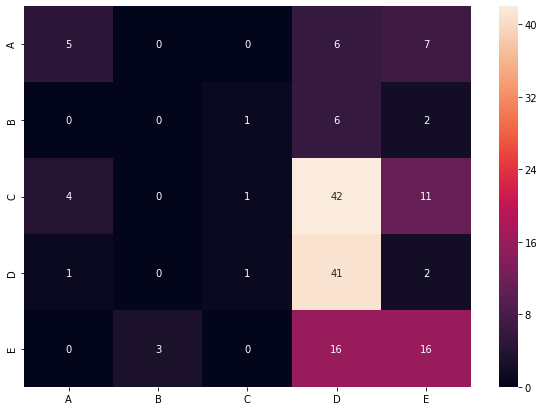


```python
#Random Forest Classifier
from sklearn.ensemble import RandomForestClassifier

forest_reg = RandomForestClassifier(bootstrap=True, class_weight=None, criterion='gini',
                       max_depth=None, max_features=3, max_leaf_nodes=None,
                       min_impurity_decrease=0.0, min_impurity_split=None,
                       min_samples_leaf=1, min_samples_split=2,
                       min_weight_fraction_leaf=0.0, n_estimators=30,
                       n_jobs=None, oob_score=False, random_state=None,
                       verbose=0, warm_start=False)

# # scores = cross_val_score(forest_reg, X_train, y_train.values.ravel(), scoring="neg_mean_squared_error", cv=10)
# rdf_scores = np.sqrt(-scores)
# display_scores(rdf_scores)

forest_reg.fit(X_train, y_train)
rf_predict = forest_reg.predict(X_test)
```


```python
rf_acore = accuracy_score(y_test, rf_predict)
print('Accuracy = {:.2f} %'.format(rf_acore*100))
# rf_acore #Accuracy For after hiperparameter is changed
```

    Accuracy = 61.21 %
    


```python
q = confusion_matrix(y_test, rf_predict)
df_cm = pd.DataFrame(q, index = [i for i in "ABCDE"],
                  columns = [i for i in "ABCDE"])
plt.figure(figsize = (10,7))
sn.heatmap(df_cm, annot=True)
```


    <matplotlib.axes._subplots.AxesSubplot at 0x2870f431ba8>


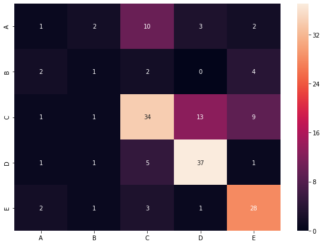


```python
from sklearn.model_selection import GridSearchCV
param_grid = [
{'n_estimators': [3, 10, 30], 'max_features': [1, 2, 3]},
{'bootstrap': [False], 'n_estimators': [3, 10], 'max_features': [2, 3, 4]},
]

forest_reg = RandomForestClassifier()
grid_search = GridSearchCV(forest_reg, param_grid, cv=5, scoring='accuracy')
grid_search.fit(X_train, y_train.values.ravel())
grid_search.best_params_
```


    {'max_features': 2, 'n_estimators': 30}


```python
grid_search.best_estimator_
```


    RandomForestClassifier(bootstrap=True, ccp_alpha=0.0, class_weight=None,
                           criterion='gini', max_depth=None, max_features=2,
                           max_leaf_nodes=None, max_samples=None,
                           min_impurity_decrease=0.0, min_impurity_split=None,
                           min_samples_leaf=1, min_samples_split=2,
                           min_weight_fraction_leaf=0.0, n_estimators=30,
                           n_jobs=None, oob_score=False, random_state=None,
                           verbose=0, warm_start=False)


```python
##########Training SVC########
from sklearn.svm import SVC
```


```python
svc_clf = SVC()
svc_clf.fit(X_train, y_train)
svc_clf_predict = svc_clf.predict(X_test)
svc_clf_acore_1 = accuracy_score(y_test, svc_clf_predict)
svc_clf_acore_1 #Accuracy For without setting any hiperparameter manually
print('Accuracy = {:.2f} %'.format(svc_clf_acore_1*100))
```

    Accuracy = 43.03 %
    


```python
#Confusion Metrix
q = confusion_matrix(y_test, svc_clf_predict)
df_cm = pd.DataFrame(q, index = [i for i in "ABCDE"],
                  columns = [i for i in "ABCDE"])
plt.figure(figsize = (10,7))
sn.heatmap(df_cm, annot=True)
```


    <matplotlib.axes._subplots.AxesSubplot at 0x2870f6e1860>


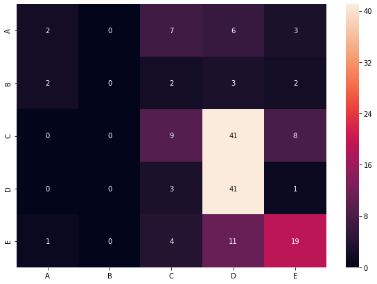


```python
#Changing the Hiperparameters
svc_clf_1 = SVC(gamma='scale')
svc_clf_1.fit(X_train, y_train)
svc_clf_predict = svc_clf_1.predict(X_test)
svc_clf_acore = accuracy_score(y_test, svc_clf_predict)
svc_clf_acore #Accuracy For after hiperparameter is changed
print('Accuracy = {:.2f} %'.format(svc_clf_acore*100))
```

    Accuracy = 43.03 %
    


```python
q = confusion_matrix(y_test, svc_clf_predict)
df_cm = pd.DataFrame(q, index = [i for i in "ABCDE"],
                  columns = [i for i in "ABCDE"])
plt.figure(figsize = (10,7))
sn.heatmap(df_cm, annot=True)
```


    <matplotlib.axes._subplots.AxesSubplot at 0x2870f602710>


```python
#Accuracy For with polykernel 
poly_kernel_svm_clf = SVC(kernel="poly")
poly_kernel_svm_clf.fit(X_train, y_train)
poly_kernel_svm_predict = poly_kernel_svm_clf.predict(X_test)
poly_kernel_svm_score = accuracy_score(y_test, poly_kernel_svm_predict)
poly_kernel_svm_score
print('Accuracy = {:.2f} %'.format(poly_kernel_svm_score*100))
```

    Accuracy = 35.15 %
    


```python
q = confusion_matrix(y_test, poly_kernel_svm_predict)
df_cm = pd.DataFrame(q, index = [i for i in "ABCDE"],
                  columns = [i for i in "ABCDE"])
plt.figure(figsize = (10,7))
sn.heatmap(df_cm, annot=True)
```


    <matplotlib.axes._subplots.AxesSubplot at 0x2870f8b27f0>


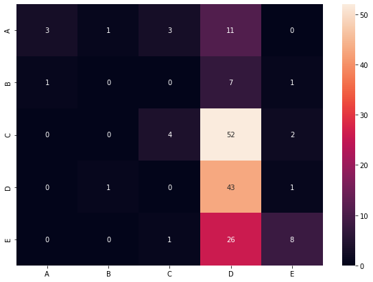


```python
#Accuracy For with polykernel with hiperparameter set
poly_kernel_svm_clf = SVC(kernel="poly", gamma='scale')
poly_kernel_svm_clf.fit(X_train, y_train)
poly_kernel_svm_predict = poly_kernel_svm_clf.predict(X_test)
poly_kernel_svm_score = accuracy_score(y_test, poly_kernel_svm_predict)
poly_kernel_svm_score
print('Accuracy = {:.2f} %'.format(poly_kernel_svm_score*100))
```

    Accuracy = 35.15 %
    


```python
q = confusion_matrix(y_test, poly_kernel_svm_predict)
df_cm = pd.DataFrame(q, index = [i for i in "ABCDE"],
                  columns = [i for i in "ABCDE"])
plt.figure(figsize = (10,7))
sn.heatmap(df_cm, annot=True)
```


    <matplotlib.axes._subplots.AxesSubplot at 0x2870f992ac8>


# Neural Netwoks


```python
from keras.models import Sequential
from keras.layers.core import Dense, Dropout, Activation, Flatten
from keras.layers.convolutional import Convolution2D, MaxPooling1D, Conv1D
from keras import layers
```

    Using TensorFlow backend.
    


```python
from sklearn.preprocessing import LabelBinarizer
encoder = LabelBinarizer()
Y = encoder.fit_transform(y_train)
```


```python
Y
```


    array([[0, 0, 0, 1, 0],
           [0, 1, 0, 0, 0],
           [0, 0, 1, 0, 0],
           ...,
           [0, 0, 0, 1, 0],
           [0, 0, 0, 1, 0],
           [0, 0, 0, 1, 0]])


```python
Y_test = encoder.fit_transform(y_test)
```


```python
Y_test[:11]
```


    array([[0, 0, 1, 0, 0],
           [0, 0, 1, 0, 0],
           [0, 0, 1, 0, 0],
           [0, 0, 0, 0, 1],
           [0, 0, 0, 1, 0],
           [0, 0, 0, 0, 1],
           [0, 0, 1, 0, 0],
           [0, 0, 0, 1, 0],
           [0, 0, 0, 0, 1],
           [0, 1, 0, 0, 0],
           [1, 0, 0, 0, 0]])


```python
# model = Sequential()
# model.add(Conv1D(12, 2, input_dim=5, activation="relu"))
# # model.add(Dense(15, activation="relu"))
# # model.add(Dense(8, activation="sigmoid"))
# # model.add(Dense(10, activation="relu"))
# # model.add(Dense(1, activation="sigmoid"))
# # model.add(MaxPooling2D(pool_size=(2,1)))

n_timesteps = 5
n_features = 1
n_outputs = 5
model = Sequential()
# model.add(Dense(12, input_))
# model.add(Conv1D(12, 2, input_dim=5, activation="relu"))
# model.add(Conv1D(filters=64, kernel_size=3, activation='relu', input_dim=5))
model.add(Conv1D(filters=64, kernel_size=3, activation='relu', input_shape=(n_timesteps,n_features)))
model.add(Conv1D(filters=64, kernel_size=3, activation='relu'))
model.add(Dropout(0.5))
model.add(MaxPooling1D(pool_size=1))
model.add(Flatten())
model.add(Dense(100, activation='relu'))
model.add(Dense(n_outputs, activation='softmax'))
model.compile(loss='categorical_crossentropy', optimizer='adam', metrics=['accuracy'])

# model.add(layers.Conv2D(64, (3, 3), activation='relu'))
# model.add(layers.MaxPooling1D(2))
# model.add(layers.Conv2D(64, (3, 3), activation='relu'))

# model.add(Flatten())
# model.add(layers.Dense(64, activation='relu'))
# model.add(layers.Dense(10, activation='softmax'))
# model.add(Dense(100))
# model.add(Dropout(0.5))
# model.add(Dense(10))
# model.add(Activation('softmax'))
# model.compile(loss='categorical_crossentropy', optimizer='adadelta', metrics=['accuracy'])
```

    WARNING:tensorflow:From C:\Users\PC\Anaconda3\lib\site-packages\tensorflow\python\ops\resource_variable_ops.py:435: colocate_with (from tensorflow.python.framework.ops) is deprecated and will be removed in a future version.
    Instructions for updating:
    Colocations handled automatically by placer.
    


```python
model = Sequential()
model.add(Dense(5, input_dim = 5, activation="relu"))
# model.add(Flatten())
model.add(Dense(15, activation='relu'))
model.add(Dense(8, activation='softmax'))
# model.add(Flatten())
model.add(Dense(5, activation="sigmoid"))
model.add(Dropout(0.5))
model.add(Dense(5))
```


```python
model.compile(loss="binary_crossentropy", optimizer="adam", metrics=["accuracy"])
```


```python
model.summary()
```

    Model: "sequential_2"
    _________________________________________________________________
    Layer (type)                 Output Shape              Param #   
    =================================================================
    dense_3 (Dense)              (None, 5)                 30        
    _________________________________________________________________
    dense_4 (Dense)              (None, 15)                90        
    _________________________________________________________________
    dense_5 (Dense)              (None, 8)                 128       
    _________________________________________________________________
    dense_6 (Dense)              (None, 5)                 45        
    _________________________________________________________________
    dropout_2 (Dropout)          (None, 5)                 0         
    _________________________________________________________________
    dense_7 (Dense)              (None, 5)                 30        
    =================================================================
    Total params: 323
    Trainable params: 323
    Non-trainable params: 0
    _________________________________________________________________
    


```python
history = model.fit(X_train, Y, epochs=100, validation_data = (X_test,Y_test), batch_size=10)
```

    WARNING:tensorflow:From C:\Users\PC\Anaconda3\lib\site-packages\tensorflow\python\ops\math_ops.py:3066: to_int32 (from tensorflow.python.ops.math_ops) is deprecated and will be removed in a future version.
    Instructions for updating:
    Use tf.cast instead.
    Train on 658 samples, validate on 165 samples
    Epoch 1/100
    658/658 [==============================] - 0s 508us/step - loss: 2.0408 - accuracy: 0.4875 - val_loss: 1.1767 - val_accuracy: 0.6109
    Epoch 2/100
    658/658 [==============================] - 0s 108us/step - loss: 1.9197 - accuracy: 0.4985 - val_loss: 1.1784 - val_accuracy: 0.6109
    Epoch 3/100
    658/658 [==============================] - 0s 106us/step - loss: 1.8153 - accuracy: 0.5106 - val_loss: 1.1843 - val_accuracy: 0.6109
    Epoch 4/100
    658/658 [==============================] - 0s 106us/step - loss: 1.7742 - accuracy: 0.5216 - val_loss: 1.1917 - val_accuracy: 0.6109
    Epoch 5/100
    658/658 [==============================] - 0s 100us/step - loss: 1.8225 - accuracy: 0.5301 - val_loss: 1.4656 - val_accuracy: 0.6109
    Epoch 6/100
    658/658 [==============================] - 0s 108us/step - loss: 1.6859 - accuracy: 0.5304 - val_loss: 1.4641 - val_accuracy: 0.6109
    Epoch 7/100
    658/658 [==============================] - 0s 100us/step - loss: 1.5602 - accuracy: 0.5413 - val_loss: 1.4610 - val_accuracy: 0.6109
    Epoch 8/100
    658/658 [==============================] - 0s 109us/step - loss: 1.3995 - accuracy: 0.5471 - val_loss: 1.4589 - val_accuracy: 0.6109
    Epoch 9/100
    658/658 [==============================] - 0s 111us/step - loss: 1.3242 - accuracy: 0.5599 - val_loss: 1.4592 - val_accuracy: 0.6109
    Epoch 10/100
    658/658 [==============================] - 0s 105us/step - loss: 1.3297 - accuracy: 0.5884 - val_loss: 1.4599 - val_accuracy: 0.6109
    Epoch 11/100
    658/658 [==============================] - 0s 111us/step - loss: 1.3040 - accuracy: 0.5909 - val_loss: 1.4602 - val_accuracy: 0.6109
    Epoch 12/100
    658/658 [==============================] - 0s 100us/step - loss: 1.3067 - accuracy: 0.5994 - val_loss: 1.4602 - val_accuracy: 0.6109
    Epoch 13/100
    658/658 [==============================] - 0s 108us/step - loss: 1.3682 - accuracy: 0.5924 - val_loss: 1.4602 - val_accuracy: 0.6109
    Epoch 14/100
    658/658 [==============================] - 0s 106us/step - loss: 1.3021 - accuracy: 0.6043 - val_loss: 1.4603 - val_accuracy: 0.6109
    Epoch 15/100
    658/658 [==============================] - 0s 114us/step - loss: 1.2699 - accuracy: 0.6000 - val_loss: 1.4604 - val_accuracy: 0.6109
    Epoch 16/100
    658/658 [==============================] - 0s 112us/step - loss: 1.3306 - accuracy: 0.6046 - val_loss: 1.4603 - val_accuracy: 0.6109
    Epoch 17/100
    658/658 [==============================] - 0s 117us/step - loss: 1.2558 - accuracy: 0.6137 - val_loss: 1.4600 - val_accuracy: 0.6109
    Epoch 18/100
    658/658 [==============================] - 0s 117us/step - loss: 1.3119 - accuracy: 0.6210 - val_loss: 1.4600 - val_accuracy: 0.6109
    Epoch 19/100
    658/658 [==============================] - 0s 147us/step - loss: 1.3456 - accuracy: 0.6055 - val_loss: 1.4602 - val_accuracy: 0.6109
    Epoch 20/100
    658/658 [==============================] - 0s 133us/step - loss: 1.2658 - accuracy: 0.6216 - val_loss: 1.4600 - val_accuracy: 0.6109
    Epoch 21/100
    658/658 [==============================] - 0s 138us/step - loss: 1.2729 - accuracy: 0.6246 - val_loss: 1.4595 - val_accuracy: 0.6109
    Epoch 22/100
    658/658 [==============================] - 0s 120us/step - loss: 1.2717 - accuracy: 0.6258 - val_loss: 1.4598 - val_accuracy: 0.6109
    Epoch 23/100
    658/658 [==============================] - 0s 105us/step - loss: 1.2222 - accuracy: 0.6228 - val_loss: 1.4596 - val_accuracy: 0.6109
    Epoch 24/100
    658/658 [==============================] - 0s 105us/step - loss: 1.1833 - accuracy: 0.6377 - val_loss: 1.4595 - val_accuracy: 0.6109
    Epoch 25/100
    658/658 [==============================] - 0s 112us/step - loss: 1.2589 - accuracy: 0.6362 - val_loss: 1.4206 - val_accuracy: 0.6109
    Epoch 26/100
    658/658 [==============================] - 0s 105us/step - loss: 1.1326 - accuracy: 0.6429 - val_loss: 0.9213 - val_accuracy: 0.6109
    Epoch 27/100
    658/658 [==============================] - 0s 115us/step - loss: 1.1433 - accuracy: 0.6426 - val_loss: 0.9000 - val_accuracy: 0.6109
    Epoch 28/100
    658/658 [==============================] - 0s 117us/step - loss: 1.0789 - accuracy: 0.6529 - val_loss: 0.8923 - val_accuracy: 0.6109
    Epoch 29/100
    658/658 [==============================] - 0s 103us/step - loss: 0.9788 - accuracy: 0.6480 - val_loss: 0.8843 - val_accuracy: 0.6109
    Epoch 30/100
    658/658 [==============================] - 0s 118us/step - loss: 0.9074 - accuracy: 0.6502 - val_loss: 0.8833 - val_accuracy: 0.6109
    Epoch 31/100
    658/658 [==============================] - 0s 114us/step - loss: 0.9665 - accuracy: 0.6678 - val_loss: 0.8828 - val_accuracy: 0.6109
    Epoch 32/100
    658/658 [==============================] - 0s 114us/step - loss: 0.9831 - accuracy: 0.6678 - val_loss: 0.8834 - val_accuracy: 0.6109
    Epoch 33/100
    658/658 [==============================] - 0s 114us/step - loss: 0.9100 - accuracy: 0.6641 - val_loss: 0.8820 - val_accuracy: 0.6109
    Epoch 34/100
    658/658 [==============================] - 0s 109us/step - loss: 0.9089 - accuracy: 0.6778 - val_loss: 0.8802 - val_accuracy: 0.6109
    Epoch 35/100
    658/658 [==============================] - 0s 114us/step - loss: 0.9585 - accuracy: 0.6809 - val_loss: 0.8794 - val_accuracy: 0.6109
    Epoch 36/100
    658/658 [==============================] - 0s 97us/step - loss: 0.9248 - accuracy: 0.6754 - val_loss: 0.8793 - val_accuracy: 0.6109
    Epoch 37/100
    658/658 [==============================] - 0s 103us/step - loss: 0.9391 - accuracy: 0.6772 - val_loss: 0.8795 - val_accuracy: 0.6109
    Epoch 38/100
    658/658 [==============================] - 0s 105us/step - loss: 0.9583 - accuracy: 0.6815 - val_loss: 0.8790 - val_accuracy: 0.6109
    Epoch 39/100
    658/658 [==============================] - 0s 106us/step - loss: 0.9192 - accuracy: 0.6869 - val_loss: 0.8788 - val_accuracy: 0.6109
    Epoch 40/100
    658/658 [==============================] - 0s 102us/step - loss: 0.8276 - accuracy: 0.6848 - val_loss: 0.8758 - val_accuracy: 0.6109
    Epoch 41/100
    658/658 [==============================] - 0s 105us/step - loss: 0.9079 - accuracy: 0.6888 - val_loss: 0.8756 - val_accuracy: 0.6109
    Epoch 42/100
    658/658 [==============================] - 0s 106us/step - loss: 0.9055 - accuracy: 0.6763 - val_loss: 0.8723 - val_accuracy: 0.6109
    Epoch 43/100
    658/658 [==============================] - 0s 102us/step - loss: 0.8448 - accuracy: 0.6821 - val_loss: 0.8725 - val_accuracy: 0.6109
    Epoch 44/100
    658/658 [==============================] - 0s 100us/step - loss: 0.8767 - accuracy: 0.6948 - val_loss: 0.8725 - val_accuracy: 0.6109
    Epoch 45/100
    658/658 [==============================] - 0s 102us/step - loss: 0.8583 - accuracy: 0.6884 - val_loss: 0.8724 - val_accuracy: 0.6109
    Epoch 46/100
    658/658 [==============================] - 0s 103us/step - loss: 0.8573 - accuracy: 0.6851 - val_loss: 0.8724 - val_accuracy: 0.7430
    Epoch 47/100
    658/658 [==============================] - 0s 103us/step - loss: 0.8762 - accuracy: 0.6881 - val_loss: 0.8728 - val_accuracy: 0.6109
    Epoch 48/100
    658/658 [==============================] - 0s 105us/step - loss: 0.8620 - accuracy: 0.6997 - val_loss: 0.8727 - val_accuracy: 0.6109
    Epoch 49/100
    658/658 [==============================] - 0s 109us/step - loss: 0.8113 - accuracy: 0.6872 - val_loss: 0.8729 - val_accuracy: 0.6109
    Epoch 50/100
    658/658 [==============================] - 0s 99us/step - loss: 0.8076 - accuracy: 0.7003 - val_loss: 0.8729 - val_accuracy: 0.6109
    Epoch 51/100
    658/658 [==============================] - 0s 103us/step - loss: 0.8195 - accuracy: 0.6842 - val_loss: 0.8725 - val_accuracy: 0.6109
    Epoch 52/100
    658/658 [==============================] - 0s 102us/step - loss: 0.8892 - accuracy: 0.6970 - val_loss: 0.8723 - val_accuracy: 0.6109
    Epoch 53/100
    658/658 [==============================] - 0s 105us/step - loss: 0.8610 - accuracy: 0.6957 - val_loss: 0.8722 - val_accuracy: 0.6109
    Epoch 54/100
    658/658 [==============================] - 0s 105us/step - loss: 0.8053 - accuracy: 0.7009 - val_loss: 0.8722 - val_accuracy: 0.6109
    Epoch 55/100
    658/658 [==============================] - 0s 103us/step - loss: 0.8703 - accuracy: 0.6970 - val_loss: 0.8721 - val_accuracy: 0.6109
    Epoch 56/100
    658/658 [==============================] - 0s 115us/step - loss: 0.8321 - accuracy: 0.6991 - val_loss: 0.8718 - val_accuracy: 0.6109
    Epoch 57/100
    658/658 [==============================] - 0s 99us/step - loss: 0.8311 - accuracy: 0.7003 - val_loss: 0.8719 - val_accuracy: 0.6109
    Epoch 58/100
    658/658 [==============================] - 0s 100us/step - loss: 0.8362 - accuracy: 0.7049 - val_loss: 0.8717 - val_accuracy: 0.7055
    Epoch 59/100
    658/658 [==============================] - 0s 102us/step - loss: 0.8308 - accuracy: 0.7021 - val_loss: 0.8718 - val_accuracy: 0.7503
    Epoch 60/100
    658/658 [==============================] - 0s 102us/step - loss: 0.8165 - accuracy: 0.6918 - val_loss: 0.8717 - val_accuracy: 0.6109
    Epoch 61/100
    658/658 [==============================] - 0s 105us/step - loss: 0.8321 - accuracy: 0.7021 - val_loss: 0.8718 - val_accuracy: 0.7067
    Epoch 62/100
    658/658 [==============================] - 0s 105us/step - loss: 0.7834 - accuracy: 0.7036 - val_loss: 0.8715 - val_accuracy: 0.7491
    Epoch 63/100
    658/658 [==============================] - 0s 127us/step - loss: 0.8196 - accuracy: 0.7027 - val_loss: 0.8715 - val_accuracy: 0.6255
    Epoch 64/100
    658/658 [==============================] - 0s 124us/step - loss: 0.8071 - accuracy: 0.7003 - val_loss: 0.8715 - val_accuracy: 0.6109
    Epoch 65/100
    658/658 [==============================] - 0s 121us/step - loss: 0.8656 - accuracy: 0.6933 - val_loss: 0.8714 - val_accuracy: 0.6109
    Epoch 66/100
    658/658 [==============================] - ETA: 0s - loss: 0.8300 - accuracy: 0.70 - 0s 105us/step - loss: 0.8189 - accuracy: 0.6991 - val_loss: 0.8707 - val_accuracy: 0.6109
    Epoch 67/100
    658/658 [==============================] - 0s 103us/step - loss: 0.8241 - accuracy: 0.7006 - val_loss: 0.8705 - val_accuracy: 0.6109
    Epoch 68/100
    658/658 [==============================] - 0s 105us/step - loss: 0.8393 - accuracy: 0.6991 - val_loss: 0.8700 - val_accuracy: 0.6109
    Epoch 69/100
    658/658 [==============================] - 0s 100us/step - loss: 0.7976 - accuracy: 0.6997 - val_loss: 0.8703 - val_accuracy: 0.6109
    Epoch 70/100
    658/658 [==============================] - 0s 105us/step - loss: 0.7942 - accuracy: 0.7015 - val_loss: 0.8702 - val_accuracy: 0.6109
    Epoch 71/100
    658/658 [==============================] - 0s 105us/step - loss: 0.7934 - accuracy: 0.7061 - val_loss: 0.6498 - val_accuracy: 0.6109
    Epoch 72/100
    658/658 [==============================] - 0s 105us/step - loss: 0.7931 - accuracy: 0.7018 - val_loss: 0.6538 - val_accuracy: 0.7891
    Epoch 73/100
    658/658 [==============================] - 0s 105us/step - loss: 0.7887 - accuracy: 0.7027 - val_loss: 0.6569 - val_accuracy: 0.7612
    Epoch 74/100
    658/658 [==============================] - 0s 105us/step - loss: 0.8211 - accuracy: 0.6964 - val_loss: 0.6814 - val_accuracy: 0.7576
    Epoch 75/100
    658/658 [==============================] - 0s 102us/step - loss: 0.8036 - accuracy: 0.7119 - val_loss: 0.7972 - val_accuracy: 0.6376
    Epoch 76/100
    658/658 [==============================] - 0s 106us/step - loss: 0.7744 - accuracy: 0.7067 - val_loss: 0.6898 - val_accuracy: 0.6109
    Epoch 77/100
    658/658 [==============================] - 0s 103us/step - loss: 0.8258 - accuracy: 0.6982 - val_loss: 0.7965 - val_accuracy: 0.6109
    Epoch 78/100
    658/658 [==============================] - 0s 103us/step - loss: 0.8132 - accuracy: 0.7046 - val_loss: 0.8034 - val_accuracy: 0.6109
    Epoch 79/100
    658/658 [==============================] - 0s 105us/step - loss: 0.7675 - accuracy: 0.6957 - val_loss: 0.7337 - val_accuracy: 0.6109
    Epoch 80/100
    658/658 [==============================] - 0s 105us/step - loss: 0.8133 - accuracy: 0.7052 - val_loss: 0.8680 - val_accuracy: 0.6230
    Epoch 81/100
    658/658 [==============================] - 0s 105us/step - loss: 0.8340 - accuracy: 0.7040 - val_loss: 0.6494 - val_accuracy: 0.7612
    Epoch 82/100
    658/658 [==============================] - 0s 106us/step - loss: 0.7801 - accuracy: 0.7076 - val_loss: 0.6557 - val_accuracy: 0.6182
    Epoch 83/100
    658/658 [==============================] - 0s 103us/step - loss: 0.8146 - accuracy: 0.7015 - val_loss: 0.6134 - val_accuracy: 0.6109
    Epoch 84/100
    658/658 [==============================] - 0s 108us/step - loss: 0.7656 - accuracy: 0.7067 - val_loss: 0.6171 - val_accuracy: 0.6109
    Epoch 85/100
    658/658 [==============================] - 0s 102us/step - loss: 0.8194 - accuracy: 0.7064 - val_loss: 0.6382 - val_accuracy: 0.6182
    Epoch 86/100
    658/658 [==============================] - 0s 106us/step - loss: 0.8055 - accuracy: 0.6994 - val_loss: 0.6488 - val_accuracy: 0.6170
    Epoch 87/100
    658/658 [==============================] - 0s 106us/step - loss: 0.7714 - accuracy: 0.7106 - val_loss: 0.6786 - val_accuracy: 0.7515
    Epoch 88/100
    658/658 [==============================] - 0s 106us/step - loss: 0.7923 - accuracy: 0.7021 - val_loss: 0.6146 - val_accuracy: 0.7855
    Epoch 89/100
    658/658 [==============================] - 0s 103us/step - loss: 0.8231 - accuracy: 0.7100 - val_loss: 0.6147 - val_accuracy: 0.7709
    Epoch 90/100
    658/658 [==============================] - 0s 105us/step - loss: 0.7901 - accuracy: 0.7067 - val_loss: 0.6156 - val_accuracy: 0.7915
    Epoch 91/100
    658/658 [==============================] - 0s 106us/step - loss: 0.7913 - accuracy: 0.7036 - val_loss: 0.6333 - val_accuracy: 0.8000
    Epoch 92/100
    658/658 [==============================] - 0s 144us/step - loss: 0.7608 - accuracy: 0.7070 - val_loss: 0.6374 - val_accuracy: 0.8000
    Epoch 93/100
    658/658 [==============================] - 0s 139us/step - loss: 0.7740 - accuracy: 0.7085 - val_loss: 0.6576 - val_accuracy: 0.8000
    Epoch 94/100
    658/658 [==============================] - 0s 133us/step - loss: 0.7639 - accuracy: 0.7043 - val_loss: 0.6611 - val_accuracy: 0.8000
    Epoch 95/100
    658/658 [==============================] - 0s 117us/step - loss: 0.7982 - accuracy: 0.7082 - val_loss: 0.7533 - val_accuracy: 0.8000
    Epoch 96/100
    658/658 [==============================] - 0s 102us/step - loss: 0.7903 - accuracy: 0.7106 - val_loss: 0.6777 - val_accuracy: 0.8000
    Epoch 97/100
    658/658 [==============================] - 0s 120us/step - loss: 0.8008 - accuracy: 0.7049 - val_loss: 0.6743 - val_accuracy: 0.8000
    Epoch 98/100
    658/658 [==============================] - 0s 121us/step - loss: 0.8067 - accuracy: 0.7027 - val_loss: 0.8040 - val_accuracy: 0.8000
    Epoch 99/100
    658/658 [==============================] - 0s 108us/step - loss: 0.7687 - accuracy: 0.7067 - val_loss: 0.6722 - val_accuracy: 0.8000
    Epoch 100/100
    658/658 [==============================] - 0s 103us/step - loss: 0.7373 - accuracy: 0.7033 - val_loss: 0.6665 - val_accuracy: 0.8000
    


```python
X_train
```


    array([[ 0.70103471,  0.55510867,  0.61111284, -0.60042079, -0.40625431],
           [ 0.79225459,  0.14613968,  0.61111284, -0.5004998 , -0.40625431],
           [ 0.36169889,  0.71615331,  0.61111284, -0.52952449, -0.40446676],
           ...,
           [ 0.69402712,  0.52794292,  0.61111284, -0.34811675, -0.40289371],
           [ 0.62895426,  0.60472561,  0.61111284, -0.60765238, -0.40625431],
           [ 0.56107715,  0.27199299,  0.61111284, -0.4761541 , -0.40460976]])


```python
import matplotlib.pyplot as plt
plt.plot(history.history['accuracy'])
plt.plot(history.history['val_accuracy'])
plt.title('Model accuracy')
plt.ylabel('Accuracy')
plt.xlabel('Epoch')
plt.legend(['Train', 'Test'], loc='upper left')
plt.show()
```


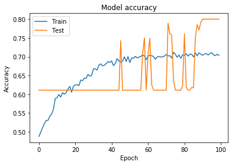


```python
plt.plot(history.history['loss'])
plt.plot(history.history['val_loss']) 
plt.title('Model loss') 
plt.ylabel('Loss') 
plt.xlabel('Epoch') 
plt.legend(['Train', 'Test'], loc='upper left') 
plt.show()
```


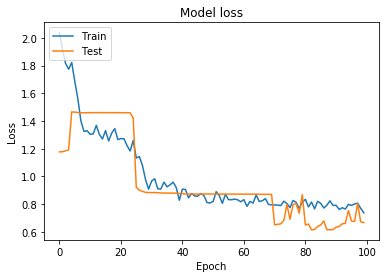


```python
NN_pred = model.predict(X_test)
```


```python
pred = list()
for i in range(len(NN_pred)):
    pred.append(str(np.argmax(NN_pred[i])))
```


```python
q = confusion_matrix(y_test, pred)
df_cm = pd.DataFrame(q, index = [i for i in "ABCDE"],
                  columns = [i for i in "ABCDE"])
plt.figure(figsize = (10,7))
sn.heatmap(df_cm, annot=True)
```


    <matplotlib.axes._subplots.AxesSubplot at 0x2870fa7b898>


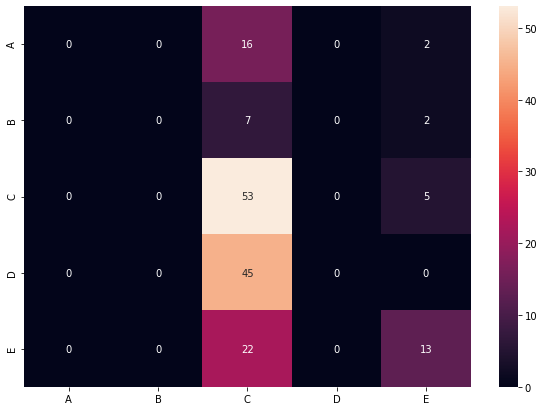


```python
NN_score = accuracy_score(y_test, pred)
print('Accuracy = {:.2f} %'.format(NN_score*100))
```

    Accuracy = 33.33 %
    

##################################################################


```python
model = Sequential()
model.add(Dense(1, input_dim = 5, activation="relu"))
# model.add(Flatten())
model.add(Dense(10, activation='relu'))
model.add(Dense(12, activation='relu'))
model.add(Dense(14, activation='relu'))
model.add(Dense(16, activation='relu'))
model.add(Dense(20, activation='relu'))
model.add(Dense(28, activation='relu'))
model.add(Dense(32, activation='softmax'))
# model.add(Flatten())
model.add(Dense(5, activation="sigmoid"))
model.add(Dropout(0.3))
model.add(Dense(5))


model.compile(loss="binary_crossentropy", optimizer="adam", metrics=["accuracy"])

model.summary()

history = model.fit(X_train, Y, epochs=100, validation_data = (X_test,Y_test), batch_size=100)


```

    Model: "sequential_3"
    _________________________________________________________________
    Layer (type)                 Output Shape              Param #   
    =================================================================
    dense_8 (Dense)              (None, 1)                 6         
    _________________________________________________________________
    dense_9 (Dense)              (None, 10)                20        
    _________________________________________________________________
    dense_10 (Dense)             (None, 12)                132       
    _________________________________________________________________
    dense_11 (Dense)             (None, 14)                182       
    _________________________________________________________________
    dense_12 (Dense)             (None, 16)                240       
    _________________________________________________________________
    dense_13 (Dense)             (None, 20)                340       
    _________________________________________________________________
    dense_14 (Dense)             (None, 28)                588       
    _________________________________________________________________
    dense_15 (Dense)             (None, 32)                928       
    _________________________________________________________________
    dense_16 (Dense)             (None, 5)                 165       
    _________________________________________________________________
    dropout_3 (Dropout)          (None, 5)                 0         
    _________________________________________________________________
    dense_17 (Dense)             (None, 5)                 30        
    =================================================================
    Total params: 2,631
    Trainable params: 2,631
    Non-trainable params: 0
    _________________________________________________________________
    Train on 658 samples, validate on 165 samples
    Epoch 1/100
    658/658 [==============================] - 0s 635us/step - loss: 2.5229 - accuracy: 0.6088 - val_loss: 2.6125 - val_accuracy: 0.6848
    Epoch 2/100
    658/658 [==============================] - 0s 23us/step - loss: 2.4000 - accuracy: 0.6137 - val_loss: 2.6030 - val_accuracy: 0.6848
    Epoch 3/100
    658/658 [==============================] - 0s 20us/step - loss: 2.3878 - accuracy: 0.6116 - val_loss: 2.5941 - val_accuracy: 0.6848
    Epoch 4/100
    658/658 [==============================] - 0s 21us/step - loss: 2.3001 - accuracy: 0.6076 - val_loss: 2.5866 - val_accuracy: 0.6848
    Epoch 5/100
    658/658 [==============================] - 0s 21us/step - loss: 2.2581 - accuracy: 0.6334 - val_loss: 2.5806 - val_accuracy: 0.6848
    Epoch 6/100
    658/658 [==============================] - 0s 21us/step - loss: 2.2038 - accuracy: 0.6380 - val_loss: 2.5744 - val_accuracy: 0.6848
    Epoch 7/100
    658/658 [==============================] - 0s 24us/step - loss: 2.2793 - accuracy: 0.6310 - val_loss: 2.5689 - val_accuracy: 0.6848
    Epoch 8/100
    658/658 [==============================] - 0s 24us/step - loss: 2.3208 - accuracy: 0.6258 - val_loss: 2.5640 - val_accuracy: 0.6848
    Epoch 9/100
    658/658 [==============================] - 0s 24us/step - loss: 2.2812 - accuracy: 0.6292 - val_loss: 2.5606 - val_accuracy: 0.8000
    Epoch 10/100
    658/658 [==============================] - 0s 21us/step - loss: 2.2688 - accuracy: 0.6240 - val_loss: 2.5570 - val_accuracy: 0.8000
    Epoch 11/100
    658/658 [==============================] - 0s 24us/step - loss: 2.1916 - accuracy: 0.6505 - val_loss: 2.5558 - val_accuracy: 0.8000
    Epoch 12/100
    658/658 [==============================] - 0s 23us/step - loss: 2.4527 - accuracy: 0.6292 - val_loss: 2.5542 - val_accuracy: 0.8000
    Epoch 13/100
    658/658 [==============================] - 0s 24us/step - loss: 2.3548 - accuracy: 0.6477 - val_loss: 2.5533 - val_accuracy: 0.8000
    Epoch 14/100
    658/658 [==============================] - 0s 23us/step - loss: 2.1967 - accuracy: 0.6587 - val_loss: 2.5519 - val_accuracy: 0.8000
    Epoch 15/100
    658/658 [==============================] - 0s 23us/step - loss: 2.2890 - accuracy: 0.6626 - val_loss: 2.5497 - val_accuracy: 0.8000
    Epoch 16/100
    658/658 [==============================] - 0s 21us/step - loss: 2.3085 - accuracy: 0.6593 - val_loss: 1.8378 - val_accuracy: 0.8000
    Epoch 17/100
    658/658 [==============================] - 0s 24us/step - loss: 2.2596 - accuracy: 0.6647 - val_loss: 1.7624 - val_accuracy: 0.8000
    Epoch 18/100
    658/658 [==============================] - 0s 23us/step - loss: 2.1583 - accuracy: 0.6781 - val_loss: 1.6587 - val_accuracy: 0.8000
    Epoch 19/100
    658/658 [==============================] - 0s 21us/step - loss: 2.0145 - accuracy: 0.6790 - val_loss: 1.6268 - val_accuracy: 0.8000
    Epoch 20/100
    658/658 [==============================] - 0s 23us/step - loss: 1.9783 - accuracy: 0.6781 - val_loss: 1.6144 - val_accuracy: 0.8000
    Epoch 21/100
    658/658 [==============================] - 0s 23us/step - loss: 1.9297 - accuracy: 0.6726 - val_loss: 1.6035 - val_accuracy: 0.8000
    Epoch 22/100
    658/658 [==============================] - 0s 23us/step - loss: 1.9480 - accuracy: 0.6739 - val_loss: 1.5934 - val_accuracy: 0.8000
    Epoch 23/100
    658/658 [==============================] - 0s 21us/step - loss: 1.8915 - accuracy: 0.6881 - val_loss: 1.5857 - val_accuracy: 0.8000
    Epoch 24/100
    658/658 [==============================] - 0s 24us/step - loss: 1.9725 - accuracy: 0.6745 - val_loss: 1.5803 - val_accuracy: 0.8000
    Epoch 25/100
    658/658 [==============================] - 0s 24us/step - loss: 2.0088 - accuracy: 0.6809 - val_loss: 1.5757 - val_accuracy: 0.8000
    Epoch 26/100
    658/658 [==============================] - 0s 21us/step - loss: 1.9443 - accuracy: 0.6793 - val_loss: 1.0431 - val_accuracy: 0.8000
    Epoch 27/100
    658/658 [==============================] - 0s 21us/step - loss: 1.7740 - accuracy: 0.6866 - val_loss: 0.9741 - val_accuracy: 0.8000
    Epoch 28/100
    658/658 [==============================] - 0s 21us/step - loss: 1.7121 - accuracy: 0.6948 - val_loss: 0.9142 - val_accuracy: 0.8000
    Epoch 29/100
    658/658 [==============================] - 0s 20us/step - loss: 1.4549 - accuracy: 0.7198 - val_loss: 0.8405 - val_accuracy: 0.8000
    Epoch 30/100
    658/658 [==============================] - 0s 24us/step - loss: 1.3121 - accuracy: 0.7234 - val_loss: 0.8147 - val_accuracy: 0.8000
    Epoch 31/100
    658/658 [==============================] - 0s 21us/step - loss: 1.4229 - accuracy: 0.7249 - val_loss: 0.8036 - val_accuracy: 0.8000
    Epoch 32/100
    658/658 [==============================] - 0s 23us/step - loss: 1.4100 - accuracy: 0.7316 - val_loss: 0.7973 - val_accuracy: 0.8000
    Epoch 33/100
    658/658 [==============================] - 0s 23us/step - loss: 1.3633 - accuracy: 0.7322 - val_loss: 0.7934 - val_accuracy: 0.8000
    Epoch 34/100
    658/658 [==============================] - 0s 24us/step - loss: 1.3310 - accuracy: 0.7240 - val_loss: 0.7904 - val_accuracy: 0.8000
    Epoch 35/100
    658/658 [==============================] - 0s 21us/step - loss: 1.3571 - accuracy: 0.7429 - val_loss: 0.7883 - val_accuracy: 0.8000
    Epoch 36/100
    658/658 [==============================] - 0s 20us/step - loss: 1.4012 - accuracy: 0.7368 - val_loss: 0.7874 - val_accuracy: 0.8000
    Epoch 37/100
    658/658 [==============================] - 0s 20us/step - loss: 1.2549 - accuracy: 0.7365 - val_loss: 0.7865 - val_accuracy: 0.8000
    Epoch 38/100
    658/658 [==============================] - 0s 20us/step - loss: 1.2609 - accuracy: 0.7371 - val_loss: 0.7850 - val_accuracy: 0.8000
    Epoch 39/100
    658/658 [==============================] - 0s 21us/step - loss: 1.4039 - accuracy: 0.7422 - val_loss: 0.7836 - val_accuracy: 0.8000
    Epoch 40/100
    658/658 [==============================] - 0s 21us/step - loss: 1.2557 - accuracy: 0.7511 - val_loss: 0.7825 - val_accuracy: 0.8000
    Epoch 41/100
    658/658 [==============================] - 0s 21us/step - loss: 1.3700 - accuracy: 0.7483 - val_loss: 0.7811 - val_accuracy: 0.8000
    Epoch 42/100
    658/658 [==============================] - 0s 21us/step - loss: 1.3223 - accuracy: 0.7465 - val_loss: 0.7796 - val_accuracy: 0.8000
    Epoch 43/100
    658/658 [==============================] - 0s 21us/step - loss: 1.3464 - accuracy: 0.7383 - val_loss: 0.7785 - val_accuracy: 0.8000
    Epoch 44/100
    658/658 [==============================] - 0s 21us/step - loss: 1.3487 - accuracy: 0.7480 - val_loss: 0.7773 - val_accuracy: 0.8000
    Epoch 45/100
    658/658 [==============================] - 0s 18us/step - loss: 1.3335 - accuracy: 0.7505 - val_loss: 0.7766 - val_accuracy: 0.8000
    Epoch 46/100
    658/658 [==============================] - 0s 21us/step - loss: 1.2899 - accuracy: 0.7529 - val_loss: 0.7762 - val_accuracy: 0.8000
    Epoch 47/100
    658/658 [==============================] - 0s 20us/step - loss: 1.3565 - accuracy: 0.7571 - val_loss: 0.7762 - val_accuracy: 0.8000
    Epoch 48/100
    658/658 [==============================] - 0s 20us/step - loss: 1.3022 - accuracy: 0.7517 - val_loss: 0.7758 - val_accuracy: 0.8000
    Epoch 49/100
    658/658 [==============================] - 0s 20us/step - loss: 1.2679 - accuracy: 0.7444 - val_loss: 0.7752 - val_accuracy: 0.8000
    Epoch 50/100
    658/658 [==============================] - 0s 18us/step - loss: 1.3435 - accuracy: 0.7505 - val_loss: 0.7742 - val_accuracy: 0.8000
    Epoch 51/100
    658/658 [==============================] - 0s 20us/step - loss: 1.2689 - accuracy: 0.7498 - val_loss: 0.7731 - val_accuracy: 0.8000
    Epoch 52/100
    658/658 [==============================] - 0s 23us/step - loss: 1.4022 - accuracy: 0.7422 - val_loss: 0.7721 - val_accuracy: 0.8000
    Epoch 53/100
    658/658 [==============================] - 0s 21us/step - loss: 1.3912 - accuracy: 0.7505 - val_loss: 0.7713 - val_accuracy: 0.8000
    Epoch 54/100
    658/658 [==============================] - 0s 20us/step - loss: 1.2562 - accuracy: 0.7295 - val_loss: 0.7637 - val_accuracy: 0.8000
    Epoch 55/100
    658/658 [==============================] - 0s 21us/step - loss: 1.2375 - accuracy: 0.7292 - val_loss: 0.7608 - val_accuracy: 0.8000
    Epoch 56/100
    658/658 [==============================] - 0s 20us/step - loss: 1.2435 - accuracy: 0.7228 - val_loss: 0.7590 - val_accuracy: 0.8000
    Epoch 57/100
    658/658 [==============================] - 0s 20us/step - loss: 1.1787 - accuracy: 0.7164 - val_loss: 0.7580 - val_accuracy: 0.8000
    Epoch 58/100
    658/658 [==============================] - 0s 21us/step - loss: 1.2807 - accuracy: 0.7304 - val_loss: 0.7574 - val_accuracy: 0.8000
    Epoch 59/100
    658/658 [==============================] - 0s 20us/step - loss: 1.3026 - accuracy: 0.7280 - val_loss: 0.7569 - val_accuracy: 0.8000
    Epoch 60/100
    658/658 [==============================] - 0s 20us/step - loss: 1.2825 - accuracy: 0.7243 - val_loss: 0.7564 - val_accuracy: 0.8000
    Epoch 61/100
    658/658 [==============================] - 0s 20us/step - loss: 1.2215 - accuracy: 0.7298 - val_loss: 0.7582 - val_accuracy: 0.8000
    Epoch 62/100
    658/658 [==============================] - 0s 21us/step - loss: 1.2382 - accuracy: 0.7322 - val_loss: 0.7596 - val_accuracy: 0.8000
    Epoch 63/100
    658/658 [==============================] - 0s 21us/step - loss: 1.1870 - accuracy: 0.7243 - val_loss: 0.7599 - val_accuracy: 0.8000
    Epoch 64/100
    658/658 [==============================] - 0s 21us/step - loss: 1.1844 - accuracy: 0.7298 - val_loss: 0.7597 - val_accuracy: 0.8000
    Epoch 65/100
    658/658 [==============================] - 0s 20us/step - loss: 1.2714 - accuracy: 0.7271 - val_loss: 0.7591 - val_accuracy: 0.8000
    Epoch 66/100
    658/658 [==============================] - 0s 20us/step - loss: 1.2282 - accuracy: 0.7435 - val_loss: 0.7585 - val_accuracy: 0.8000
    Epoch 67/100
    658/658 [==============================] - 0s 20us/step - loss: 1.1625 - accuracy: 0.7438 - val_loss: 0.7579 - val_accuracy: 0.8000
    Epoch 68/100
    658/658 [==============================] - 0s 21us/step - loss: 1.2098 - accuracy: 0.7471 - val_loss: 0.7578 - val_accuracy: 0.8000
    Epoch 69/100
    658/658 [==============================] - 0s 21us/step - loss: 1.1207 - accuracy: 0.7422 - val_loss: 0.7573 - val_accuracy: 0.8000
    Epoch 70/100
    658/658 [==============================] - 0s 23us/step - loss: 1.1944 - accuracy: 0.7398 - val_loss: 0.7568 - val_accuracy: 0.8000
    Epoch 71/100
    658/658 [==============================] - 0s 21us/step - loss: 1.2330 - accuracy: 0.7477 - val_loss: 0.7562 - val_accuracy: 0.8000
    Epoch 72/100
    658/658 [==============================] - 0s 21us/step - loss: 1.2441 - accuracy: 0.7283 - val_loss: 0.7556 - val_accuracy: 0.8000
    Epoch 73/100
    658/658 [==============================] - 0s 20us/step - loss: 1.2265 - accuracy: 0.7477 - val_loss: 0.7550 - val_accuracy: 0.8000
    Epoch 74/100
    658/658 [==============================] - 0s 21us/step - loss: 1.2389 - accuracy: 0.7456 - val_loss: 0.7544 - val_accuracy: 0.8000
    Epoch 75/100
    658/658 [==============================] - 0s 21us/step - loss: 1.2078 - accuracy: 0.7535 - val_loss: 0.7538 - val_accuracy: 0.8000
    Epoch 76/100
    658/658 [==============================] - 0s 21us/step - loss: 1.1894 - accuracy: 0.7429 - val_loss: 0.7533 - val_accuracy: 0.8000
    Epoch 77/100
    658/658 [==============================] - 0s 20us/step - loss: 1.1984 - accuracy: 0.7340 - val_loss: 0.7528 - val_accuracy: 0.8000
    Epoch 78/100
    658/658 [==============================] - 0s 21us/step - loss: 1.2303 - accuracy: 0.7401 - val_loss: 0.7524 - val_accuracy: 0.8000
    Epoch 79/100
    658/658 [==============================] - 0s 21us/step - loss: 1.2572 - accuracy: 0.7392 - val_loss: 0.7520 - val_accuracy: 0.8000
    Epoch 80/100
    658/658 [==============================] - 0s 20us/step - loss: 1.2151 - accuracy: 0.7392 - val_loss: 0.7518 - val_accuracy: 0.8000
    Epoch 81/100
    658/658 [==============================] - 0s 24us/step - loss: 1.1971 - accuracy: 0.7362 - val_loss: 0.7517 - val_accuracy: 0.8000
    Epoch 82/100
    658/658 [==============================] - 0s 21us/step - loss: 1.1980 - accuracy: 0.7340 - val_loss: 0.7516 - val_accuracy: 0.8000
    Epoch 83/100
    658/658 [==============================] - 0s 21us/step - loss: 1.1934 - accuracy: 0.7416 - val_loss: 0.7515 - val_accuracy: 0.8000
    Epoch 84/100
    658/658 [==============================] - 0s 20us/step - loss: 1.2662 - accuracy: 0.7398 - val_loss: 0.7514 - val_accuracy: 0.8000
    Epoch 85/100
    658/658 [==============================] - ETA: 0s - loss: 1.2233 - accuracy: 0.75 - 0s 20us/step - loss: 1.2724 - accuracy: 0.7468 - val_loss: 0.7513 - val_accuracy: 0.8000
    Epoch 86/100
    658/658 [==============================] - 0s 21us/step - loss: 1.2872 - accuracy: 0.7386 - val_loss: 0.7512 - val_accuracy: 0.8000
    Epoch 87/100
    658/658 [==============================] - 0s 20us/step - loss: 1.2002 - accuracy: 0.7343 - val_loss: 0.7512 - val_accuracy: 0.8000
    Epoch 88/100
    658/658 [==============================] - 0s 21us/step - loss: 1.2349 - accuracy: 0.7365 - val_loss: 0.7511 - val_accuracy: 0.8000
    Epoch 89/100
    658/658 [==============================] - 0s 20us/step - loss: 1.2202 - accuracy: 0.7386 - val_loss: 0.7510 - val_accuracy: 0.8000
    Epoch 90/100
    658/658 [==============================] - 0s 21us/step - loss: 1.1509 - accuracy: 0.7453 - val_loss: 0.7508 - val_accuracy: 0.8000
    Epoch 91/100
    658/658 [==============================] - 0s 20us/step - loss: 1.1871 - accuracy: 0.7374 - val_loss: 0.7507 - val_accuracy: 0.8000
    Epoch 92/100
    658/658 [==============================] - 0s 21us/step - loss: 1.2047 - accuracy: 0.7395 - val_loss: 0.7513 - val_accuracy: 0.8000
    Epoch 93/100
    658/658 [==============================] - 0s 20us/step - loss: 1.1988 - accuracy: 0.7413 - val_loss: 0.7516 - val_accuracy: 0.8000
    Epoch 94/100
    658/658 [==============================] - 0s 21us/step - loss: 1.2574 - accuracy: 0.7398 - val_loss: 0.7515 - val_accuracy: 0.8000
    Epoch 95/100
    658/658 [==============================] - 0s 23us/step - loss: 1.2472 - accuracy: 0.7489 - val_loss: 0.7513 - val_accuracy: 0.8000
    Epoch 96/100
    658/658 [==============================] - 0s 21us/step - loss: 1.2501 - accuracy: 0.7337 - val_loss: 0.7511 - val_accuracy: 0.8000
    Epoch 97/100
    658/658 [==============================] - 0s 20us/step - loss: 1.2551 - accuracy: 0.7468 - val_loss: 0.7508 - val_accuracy: 0.8000
    Epoch 98/100
    658/658 [==============================] - 0s 21us/step - loss: 1.1443 - accuracy: 0.7395 - val_loss: 0.7506 - val_accuracy: 0.8000
    Epoch 99/100
    658/658 [==============================] - 0s 20us/step - loss: 1.2053 - accuracy: 0.7502 - val_loss: 0.7504 - val_accuracy: 0.8000
    Epoch 100/100
    658/658 [==============================] - 0s 20us/step - loss: 1.1911 - accuracy: 0.7462 - val_loss: 0.7503 - val_accuracy: 0.8000
    


```python
plt.plot(history.history['accuracy'])
plt.plot(history.history['val_accuracy'])
plt.title('Model accuracy')
plt.ylabel('Accuracy')
plt.xlabel('Epoch')
plt.legend(['Train', 'Test'], loc='upper left')
plt.show()


plt.plot(history.history['loss'])
plt.plot(history.history['val_loss']) 
plt.title('Model loss') 
plt.ylabel('Loss') 
plt.xlabel('Epoch') 
plt.legend(['Train', 'Test'], loc='upper left') 
plt.show()

NN_pred = model.predict(X_test)

pred = list()
for i in range(len(NN_pred)):
    pred.append(str(np.argmax(NN_pred[i])))
    
q = confusion_matrix(y_test, pred)
# df_cm = pd.DataFrame(q, index = [i for i in "ABCDE"],
#                   columns = [i for i in "ABCDE"])
# plt.figure(figsize = (10,7))
# sn.heatmap(df_cm, annot=True)

NN_score = accuracy_score(y_test, pred)
print('Accuracy = {:.2f} %'.format(NN_score*100))

plot_confusion_matrix_from_data(y_test, pred)
```


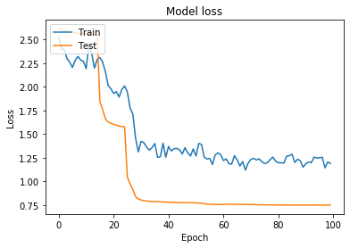


    Accuracy = 40.00 %
    


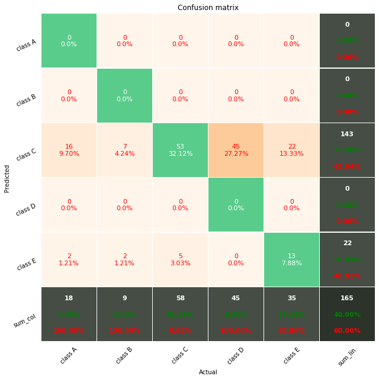


```python
from sklearn.neural_network import MLPClassifier

# clf = MLPClassifier(solver='lbfgs', alpha=1e-5,
#                     hidden_layer_sizes=(5, 2), random_state=1)
clf = MLPClassifier(solver='lbfgs', alpha=1e-5,
                    hidden_layer_sizes=13, max_iter= 500, random_state=9)


clf.fit(X_train, y_train)

pred = clf.predict(X_test)
```

    C:\Users\PC\Anaconda3\lib\site-packages\sklearn\neural_network\_multilayer_perceptron.py:470: ConvergenceWarning: lbfgs failed to converge (status=1):
    STOP: TOTAL NO. of ITERATIONS REACHED LIMIT.
    
    Increase the number of iterations (max_iter) or scale the data as shown in:
        https://scikit-learn.org/stable/modules/preprocessing.html
      self.n_iter_ = _check_optimize_result("lbfgs", opt_res, self.max_iter)
    


```python
plot_confusion_matrix_from_data(y_test, pred)
score = accuracy_score(y_test, pred)
print('Accuracy = {:.2f} %'.format(score*100))
```

    C:\Users\PC\Desktop\New_Fiverr\oshanidi\confusion_matrix_pretty_print.py:165: MatplotlibDeprecationWarning: 
    The tick1On function was deprecated in Matplotlib 3.1 and will be removed in 3.3. Use Tick.tick1line.set_visible instead.
      t.tick1On = False
    C:\Users\PC\Desktop\New_Fiverr\oshanidi\confusion_matrix_pretty_print.py:166: MatplotlibDeprecationWarning: 
    The tick2On function was deprecated in Matplotlib 3.1 and will be removed in 3.3. Use Tick.tick2line.set_visible instead.
      t.tick2On = False
    C:\Users\PC\Desktop\New_Fiverr\oshanidi\confusion_matrix_pretty_print.py:168: MatplotlibDeprecationWarning: 
    The tick1On function was deprecated in Matplotlib 3.1 and will be removed in 3.3. Use Tick.tick1line.set_visible instead.
      t.tick1On = False
    C:\Users\PC\Desktop\New_Fiverr\oshanidi\confusion_matrix_pretty_print.py:169: MatplotlibDeprecationWarning: 
    The tick2On function was deprecated in Matplotlib 3.1 and will be removed in 3.3. Use Tick.tick2line.set_visible instead.
      t.tick2On = False
    


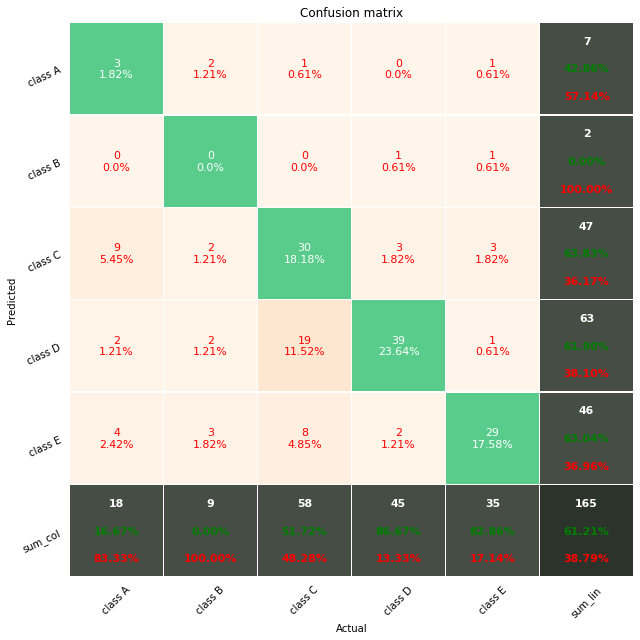


    Accuracy = 61.21 %
    


```python
param_grid = {'solver': ['lbfgs'], 'max_iter': [100,200,500 ], 'alpha': 10.0 ** -np.arange(1, 10), 'hidden_layer_sizes':np.arange(10, 15), 'random_state':[0,1,2,3,4,5,6,7,8,9]}
# solver='lbfgs', alpha=1e-5,
#                     hidden_layer_sizes=(5, 2), random_state=1
clf = GridSearchCV(MLPClassifier(), param_grid, n_jobs=-1)
clf.fit(X_train, y_train.values.ravel())
clf.best_params_
```

    C:\Users\PC\Anaconda3\lib\site-packages\sklearn\neural_network\_multilayer_perceptron.py:470: ConvergenceWarning: lbfgs failed to converge (status=1):
    STOP: TOTAL NO. of ITERATIONS REACHED LIMIT.
    
    Increase the number of iterations (max_iter) or scale the data as shown in:
        https://scikit-learn.org/stable/modules/preprocessing.html
      self.n_iter_ = _check_optimize_result("lbfgs", opt_res, self.max_iter)
    


    {'alpha': 0.0001,
     'hidden_layer_sizes': 13,
     'max_iter': 500,
     'random_state': 9,
     'solver': 'lbfgs'}


```python
clf.best_estimator_
```


    MLPClassifier(activation='relu', alpha=0.01, batch_size='auto', beta_1=0.9,
                  beta_2=0.999, early_stopping=False, epsilon=1e-08,
                  hidden_layer_sizes=12, learning_rate='constant',
                  learning_rate_init=0.001, max_fun=15000, max_iter=100,
                  momentum=0.9, n_iter_no_change=10, nesterovs_momentum=True,
                  power_t=0.5, random_state=3, shuffle=True, solver='lbfgs',
                  tol=0.0001, validation_fraction=0.1, verbose=False,
                  warm_start=False)


```python
10.0 **-np.arange(1, 10)
```


    array([1.e-01, 1.e-02, 1.e-03, 1.e-04, 1.e-05, 1.e-06, 1.e-07, 1.e-08,
           1.e-09])


```python

```
